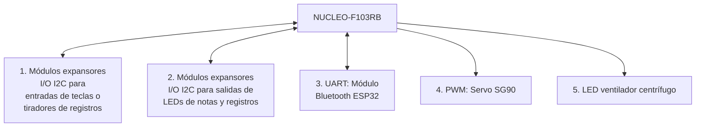

 

  

# Sistema de gestión de órganos de tubos con microcontroladores

<table align="center">
  <tr>
    <th>Autor</th>
    <th>Padrón</th>
    <th>Mail</th>
  </tr>
  <tr>
    <td>Costantini, Martín</td>
    <td>104171</td>
    <td>mcostantini@fi.uba.ar</td>
  </tr>
  <tr>
    <td>Díaz, Mateo Fermín</td>
    <td>110629</td>
    <td>mfdiaz@fi.uba.ar</td>
  </tr>
</table>

2025 | 2do Cuatrimestre

# 1. Selección del proyecto a implementar

## 1.1. Objetivo del proyecto
El objetivo de este proyecto es implementar un **sistema completo y moderno de control de órganos de tubos** que provea al usuario la posibilidad de ejecutarlo desde al consola, desde el celular, recursos para facilitar la ejecución del mismo y herramientas para mejorar la eficiencia a la hora de realiza mantenimiento. Una vez logrado un MVP, el proyecto será escalado y será implementado en un órgano de tubos real.

## 1.2. Funcionamiento básico de un órgano de tubos

Los **órganos de tubos** consisten básicamente en cuatro partes. Ventilador o **compresor de aire, válvulas, sistema de accionamiento de válvulas y tubos**.

El **ventilador centrífugo presuriza** el aire, el cual llega hasta la secreta, en donde se encuentran las **válvulas** que permiten el paso o no de dicho aire presurizado hacia las distintas **filas de tubos** o **columnas de notas**.

El primer bloque que se realiza para conceptualizarlos, es el de las **divisiones**. Por cada **manual** (teclado para dedos) que tenga el órgano, se considera **una división**. El 99\% de los órganos posee además la **divisón** que se llama **pedalera**, donde se encuentran notas que se tocan con los pies, organizadas de la misma manera que los manuales, en 12 notas por octava.
El siguiente bloque son los **registros**, donde cada registro consiste en una **cantidad igual de tubos que de notas tenga la división** (ya sea cantidad de teclas por manual o de pedales en la pedalera). Por ejemplo, si el teclado tiene 61 teclas (5 octavas + nota superior), un registro consistirá en 61 tubos. Un órgano suele tener varios registros por división, donde cada registro le pertenece a cada división.

 

  

<em>Figura 1: Vista esquemática de un órgano de tubos</em>

**Cada división posee una válvula por nota**. Para hacer sonar **individualmente cada registro**, existe una válvula por registro, donde dicha válvula permite o no, el ingreso del aire presurizado al compartimento de cada registro. Combinando la **valvula de una nota** en particular **de una división** y la **válvula de activación del registro particular**, se logra hacer **sonar cada tubo individualmente**. De abrir simultáneamente varias válvulas, se puede hacer sonar la misma nota en distintos registros seleccionados al mismo tiempo, también distintas notas en el mismo registro, o la combinación de ambas. En órganos antiguos se realizaba todo de forma mecánica con varillaje, **modernamente se utilizan soluciones** electroneumáticas o directamente **eléctricas** (hubo un paso histórico muy oscuro y caótico por máquinas puramente neumáticas).

 

  

<em>Figura 2: Vista esquemática detallada por funciones</em>

Como es de suponer, existen diversos **mecanismos para facilitar la ejecución del instrumento** llamados **acoples**.`Tracción` o `enclavamiento` se llama al caso de conectar las notas de dos divisiones distintas. `Super` al de conectar una nota con la misma nota de la octava superior. `Sub`, mismo caso en la octava inferior. `Super II/I`, combinando ambos efectos, conectando una nota del manual I con la nota de la octava superior, pero del manual II.

 

  

<em>Figura 3: Consola del órgano de tubos de Notre Dame de Paris</em>

También existen **presets de registros**, que consisten en **memorias** de activación de ciertos registros de acceso rápido llamadas `combinaciones libres`. Dichas combinaciones **se setean** eligiendo los registros a guardar desde sus tiradores individuales, apretando un **botón de set** y luego el **botón de la combinación libre** en donde guardar dicho set. En órganos modernos, existen **perfiles de usuario** para poder guardar distintas combinaciones sin tener que modificarlas nuevamente cada vez que otro usuario guarde combinaciones distintas en el instrumento para utilizarlo.

Por último, existen divisiones enteras que **se encuentran encerradas en cajas** de madera con persianas. Se las llama `expresivas`, `enclosed`, `swell`, etc. Dichas persianas se operan desde un **pedal de expresión** que, al cambiar su ángulo, **abre o cierra dichas persianas** de madera. De esta forma se logra aumentar o disminuir el volumen y tener un efecto de presencia del sonido en una habitación contigua, de forma progresiva. En órganos mecánicos se realizaba con varillaje y pesas, modernamente se utilizan **motores eléctricos**.

## 1.3. Desarrollo de las funcionalidades en el microcontrolador

Se implementará un **gestor cíclico de tareas con WCET** para **evitar retrasos**, asegurar un **tiempo medible, predecible y estable** de ejecución. De encontrar contratiempos en la ejecución de las tareas, se buscará **dividirlas** y organizarlas para lograr la **mínima latencia** posible.

Se establecerán dos **modos** de funcionamiento, **config y exec**. En el primer modo, **config**, se permitirá el cambio de perfiles de usuario, seteo de combinaciones libres, seteo de modos de apertura de persianas (lectura analógica lineal del pedal de expresión, ejecución lineal, logarítmica u otras), ejecución por bluetooth de notas (para afinación del instrumento sin necesidad de ayudantes) o canciones según teclado en app o vía MIDI (escucharse a uno mismo tocando desde otro punto del recinto acústico a partir de una grabación MIDI), prendido o apagado del ventilador centrífugo (en el TP, un led), etc. En el segundo modo, **exec** (ejecución del instrumento), se permitirá unicamente la apertura y cierre de válvulas (en el TP, leds) o persianas (en el TP, motor paso a paso).

Por el lado del **funcionamiento electrónico externo**, tanto para **leer las notas/botones** presionados como para controlar los leds, se utilizarán **módulos expansores i/o**, que funcionan por $i^2c$, los cuales registran con FFs las entradas o salidas, permitiendo así **multiplexar** y demultiplexar con métodos y tecnología moderna. Para el caso del motor paso a paso, se controlará vía salida **PWM**. Para el **bluetooth** se utilizará el módulo comercial **ESP32** de envío y recepción de datos con el microcontrolador vía UART. Se diseñará una **app para celular**, para poder manejar los modos de funcionamiento remotamente.

> Para realizar el trabajo, **se implementarán dos manuales** de 15 notas (solo las blancas o naturales) **y pedalera** de 8 notas. Cada **división** contará con **3 registros propios**.

## 1.4. Diagrama en bloques de periféricos

<em>Figura 4: Diagrama en bloques del sistema</em>

## 2. Elicitación de requisitos y casos de uso

**En Argentina no existe competencia alguna** para este tipo de sistemas de control de órganos de tubos. Existe **mercado**, pero es **muy reducido** debido a la falta de recursos monetarios de las instituciones que albergan este tipo de instrumentos. Tiene mucho **potencial de exportación** a otros países como `Alemania`, `Estados Unidos`, `Francia`, en donde donde es muy común encontrar este tipo de instrumentos, se los aprecia, se los **mantiene con regularidad** y las soluciones electrónicas (sistema central de control) **no tienen** un costo menor a `USD 5000`, sin contar los periféricos externos como electroimanes. Por tanto, **como MVP, es muy viable para producción a baja escala** con altos grados de personalización ya que el mercado no altamente competitivo y no trabaja con métricas de ganancia por volumen en donde el centavo de reducción marca la diferencia. Mas bién **destacaría el producto por la calidad** de materiales, terminación, fiabilidad, configurabilidad y facilidad de mantenimiento.

| Grupo | ID | Descripción |
| :---- | :---- | :---- |
| Configuración | 1.1 | El sistema permitirá el encendido  y apagado del ventilador centrífugo |
|  | 1.2 | El sistema permitirá la modificación de presets |
|  | 1.3 | El sistema permitirá la modificación de función de respuesta al pedal expresivo |
| Indicadores | 2.1 | El sistema contará con indicadores luminosos para mostrar registros seleccionados |
|  | 2.2 | El sistema contará con indicadores luminosos para mostrar acoplamientos seleccionados |
|  | 2.3 | El sistema contará con indicadores luminosos que marquen preset seleccionado|
|  | 2.4 | El sistema contará con indicadores luminosos que marquen perfil seleccionado|
|  | 2.5 | El sistema contará con un indicador luminoso que marque entrada vía Bluetooth|
| Motor | 3.1  | El sistema contará con un servo motor para abrir y cerrar las persianas el cual debe ser inicialmente calibrado|
| Comunicación Bluetooth | 4.1 | El sistema se comunicará mediante Bluetooth con la aplicación de celular |
|  | 4.2 | La aplicación permitirá cambiar de modos de operación y perfiles de usuario|
|  | 4.3 | El sistema deberá enviar en tiempo real a la aplicación las notas en formato MIDI que se estén ejecutando, de habilitar la opción desde el celular|
|  | 4.4 | El sistema deberá recibir en formato MIDI y ejecutar en tiempo real las notas que se envíen desde el celular, de habilitar la opción desde el celular |
| Aplicación | 5.1 | La aplicación actualizará al conectar la base de datos de los perfiles guardados |
|  | 5.2 | La aplicación deberá permitirle al usuario configurar el modo de trabajo |
|  | 5.3 | La aplicación deberá poder recibir notas MIDI, realizar una grabación MIDI y guardarla |
|  | 5.4 | La aplicación deberá poder enviar notas MIDI desde un teclado virtual o desde una grabación |
|  | 5.5 | La aplicación deberá permitirle al usuario modificar los presets guardados en los perfiles |
| Interruptores/ Botones | 6.1 | El sistema contará con botones para indicar las notas musicales en el teclado |

<em>Tabla 1: Requisitos del proyecto</em>

Los **casos de uso** para este tipo de proyecto son prácticamente **infinitos** y cada uno de ellos representa **un flujo de ejecución muy simple** en donde, por ejemplo, se presiona una tecla. Esto último, según los registros seleccionados, prende determinada cantidad de leds de salida, que representan los electroimanes de las notas que deben sonar. **No tiene sentido explayarse** en casos de uso, ya que **fueron explicados para entender el funcionamiento del instrumento** en sí, que es un aparato complejo y poco conocido.
