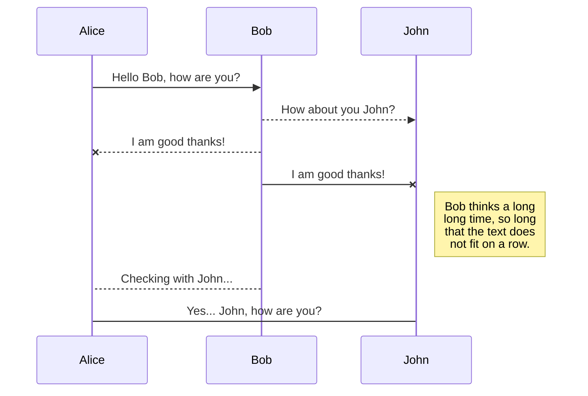
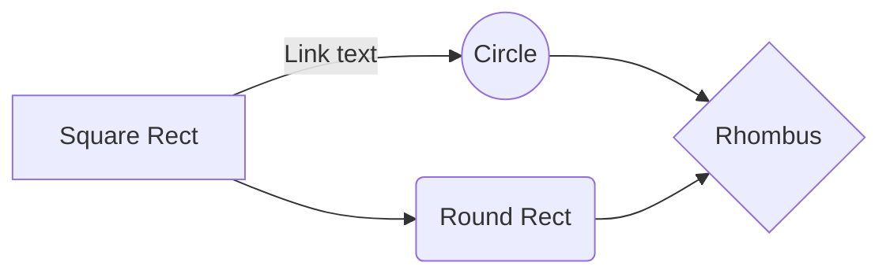

 

# Sistema de gestión de órganos de tubos con microcontroladores
**2do Cuatrimestre, 2025**
|Autor|Padrón|Mail|
|----------------|-------------------------------|---------------------|
|Costantini, Martín|104171|mcostantini@fi.uba.ar|
|Diaz, Mateo Fermín|110629|mfdiaz@fi.uba.ar|

A continuación, **se presenta la idea a desarrollar** en el trabajo práctico final de la asignatura-taller. Consiste en un **sistema completo y moderno de control de órganos de tubos** e incluye potencialmente todas las técnicas aprendidas durante el curso.

## Funcionamiento básico de un órgano de tubos

Los **órganos de tubos** consisten básicamente en cuatro partes. Ventilador o **compresor de aire, válvulas, sistema de accionamiento de válvulas y tubos**.

El **ventilador centrífugo presuriza** el aire, el cual llega hasta la secreta, en donde se encuentran las **válvulas** que permiten el paso o no de dicho aire presurizado hacia las distintas **filas de tubos** o **columnas de notas**.

El primer bloque que se realiza para conceptualizarlos, es el de las **divisiones**. Por cada **manual** (teclado para dedos) que tenga el órgano, se considera **una división**. El 99\% de los órganos posee además la **divisón** que se llama **pedalera**, donde se encuentran notas que se tocan con los pies, organizadas de la misma manera que los manuales, en 12 notas por octava.
El siguiente bloque son los **registros**, donde cada registro consiste en una **cantidad igual de tubos que de notas tenga la división** (ya sea cantidad de teclas por manual o de pedales en la pedalera). Por ejemplo, si el teclado tiene 61 teclas (5 octavas + nota superior), un registro consistirá en 61 tubos. Un órgano suele tener varios registros por división, donde cada registro le pertenece a cada división.

**Cada división posee una válvula por nota**. Para hacer sonar **individualmente cada registro**, existe una válvula por registro, donde dicha válvula permite o no, el ingreso del aire presurizado al compartimento de cada registro. Combinando la **valvula de una nota** en particular **de una división** y la **válvula de activación del registro particular**, se logra hacer **sonar cada tubo individualmente**. De abrir simultáneamente varias válvulas, se puede hacer sonar la misma nota en distintos registros seleccionados al mismo tiempo, también distintas notas en el mismo registro, o la combinación de ambas. En órganos antiguos se realizaba todo de forma mecánica con varillaje, **modernamente se utilizan soluciones** electroneumáticas o directamente **eléctricas** (hubo un paso histórico muy oscuro y caótico por máquinas puramente neumáticas).

Como es de suponer, existen diversos **mecanismos para facilitar la ejecución del instrumento** llamados **acoples**.`Tracción` o `enclavamiento` se llama al caso de conectar las notas de dos divisiones distintas. `Super` al de conectar una nota con la misma nota de la octava superior. `Sub`, mismo caso en la octava inferior. `Super II/I`, combinando ambos efectos, conectando una nota del manual I con la nota de la octava superior, pero del manual II.

También existen **presets de registros**, que consisten en **memorias** de activación de ciertos registros de acceso rápido llamadas `combinaciones libres`. Dichas combinaciones **se setean** eligiendo los registros a guardar desde sus tiradores individuales, apretando un **botón de set** y luego el **botón de la combinación libre** en donde guardar dicho set. En órganos modernos, existen **perfiles de usuario** para poder guardar distintas combinaciones sin tener que modificarlas nuevamente cada vez que otro usuario guarde combinaciones distintas en el instrumento para utilizarlo.

Por último, existen divisiones enteras que **se encuentran encerradas en cajas** de madera con persianas. Se las llama `expresivas`, `enclosed`, `swell`, etc. Dichas persianas se operan desde un **pedal de expresión** que, al cambiar su ángulo, **abre o cierra dichas persianas** de madera. De esta forma se logra aumentar o disminuir el volumen y tener un efecto de presencia del sonido en una habitación contigua, de forma progresiva. En órganos mecánicos se realizaba con varillaje y pesas, modernamente se utilizan **motores eléctricos**.

## Desarrollo en el microcontrolador

Se puede ver rápidamente que el **sistema** es muy apto para ser **desarrollado en un microcontrolador**, razón por la cual se eligió instantáneamente la idea.

En primer lugar, se implementará un gestor de tareas con WCET para no tener retrasos, asegurar un tiempo medible, predecible y estable de ejecución. De encontrar contratiempos en la ejecución de las tareas, se buscará reducirlas y organizarlas para lograr la mínima latencia posible.

Se poseerán dos modos de funcionamiento, config y exec. En el primer modo, se permitirá el cambio de perfiles de usuario, seteo de combinaciones libres, seteo de modos de apertura de persianas (lectura analógica lineal del pedal de expresión, ejecución lineal, logarítmica u otras), ejecución por bluetooth de notas (para afinación del instrumento sin necesidad de ayudantes) o canciones según teclado en app o vía MIDI (escucharse a uno mismo tocando desde otro punto del recinto acústico), prendido o apagado del ventilador centrífugo (en el TP, un buzzer), etc. En el segundo modo, exec (ejecución del instrumento), se permitirá unicamente la apertura y cierre de válvulas (en el TP, leds) o persianas (en el TP, motor paso a paso).

Por el lado del funcionamiento electrónico externo, tanto para leer las notas/botones presionados como para controlar los electroimanes, se utilizarán módulos expansores i/o, que funcionan por $i^2c$, los cuales registran con FFs las entradas o salidas, permitiendo así multiplexar y demultiplexar con métodos y tecnología moderna. Para el caso del motor paso a paso, se utilizarán drivers en hardware.

Para el bluetooth se utilizará algún módulo comercial de envío y recepción con el microcontrolador. Se diseñará una app en el celular para poder manejar los modos de funcionamiento remotamente.

Se implementarán dos manuales de 15 notas (solo las blancas o naturales) y pedalera de 8 notas. Cada división contará con 3 registros propios. El proyecto se diseñará para ser en escalado en un futuro y poder ser implementado en un órgano de tubos real ubicado en Palermo, CABA (donde uno de los integrantes del grupo es organista).

La implementación general está abierta a ser modificada y la presentación final, con mucha seguridad, sufrirá modificaciones según disponibilidad de materiales, costos y complicaciones adicionales.

> **Note:** Add **a note** here with this format.

## KaTeX

You can render LaTeX mathematical expressions using [KaTeX](https://khan.github.io/KaTeX/):

The *Gamma function* satisfying $\Gamma(n) = (n-1)!\quad\forall n\in\mathbb N$ is via the Euler integral

$$
\Gamma(z) = \int_0^\infty t^{z-1}e^{-t}dt\,.
$$

> You can find more information about **LaTeX** mathematical expressions [here](http://meta.math.stackexchange.com/questions/5020/mathjax-basic-tutorial-and-quick-reference).

## UML diagrams

You can render UML diagrams using [Mermaid](https://mermaidjs.github.io/). For example, this will produce a sequence diagram:

And this will produce a flow chart:

