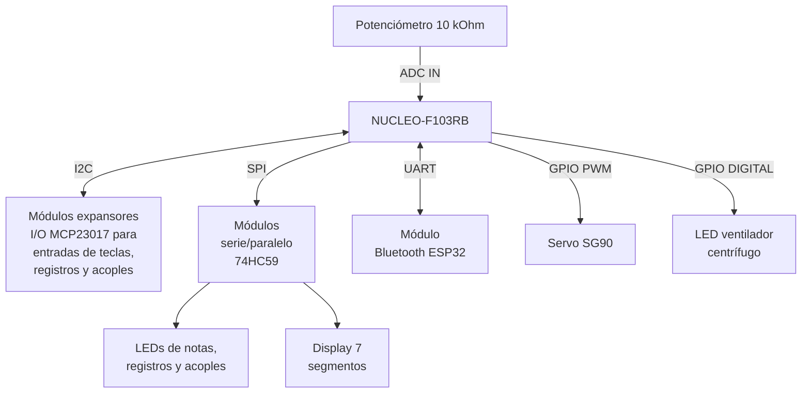



  

# Sistema de gestión de órganos de tubos con microcontroladores

<table align="center">
  <tr>
    <th>Autor</th>
    <th>Padrón</th>
    <th>Mail</th>
  </tr>
  <tr>
    <td>Costantini, Martín</td>
    <td>104171</td>
    <td>mcostantini@fi.uba.ar</td>
  </tr>
  <tr>
    <td>Díaz, Mateo Fermín</td>
    <td>110629</td>
    <td>mfdiaz@fi.uba.ar</td>
  </tr>
</table>

  2025 | 2do Cuatrimestre

  Taller de Sistemas Embebidos (TA134)

# 1. Selección del proyecto a implementar y descripción

## 1.1. Objetivo del proyecto

El objetivo de este proyecto es implementar un sistema completo y moderno de control de órganos de tubos que permita al usuario ejecutarlo desde la consola, el celular, provea recursos para facilitar la ejecución del mismo y herramientas para mejorar la eficiencia a la hora de realizarle mantenimiento. Una vez logrado un MVP, el proyecto será escalado y, de ser posible, implementado en un órgano de tubos real.

## 1.2. Funcionamiento básico de un órgano de tubos

Los órganos de tubos se pueden subdividir en cuatro partes básicas. 

* Ventilador o compresor de aire
* Válvulas
* Sistema de accionamiento de válvulas
* Tubos

Un ventilador centrífugo presuriza el aire, el cual se almacena en fuelles que a su vez, regulan la presión. El aire presurizado llega hasta la secreta, en donde se encuentran las válvulas que pueden permitir su paso hacia las distintas filas de tubos o columnas de notas.

El primer bloque que se realiza para conceptualizarlos, es el de las divisiones. Por cada manual (teclado para dedos) que tenga un órgano, se considera una división. Salvo contadas excepciones, los órganos también poseen la divisón llamada pedalera, donde se encuentran notas que se tocan con los pies, organizadas de la misma forma que los manuales, en 12 notas por octava, con 7 blancas y 5 negras intercaladas de la forma tradicional.

El siguiente bloque conceptual son los registros, donde cada registro consiste en una cantidad igual de tubos que de notas tenga la división (ya sea cantidad de teclas por manual o pedales en la pedalera). Por ejemplo, si un manual tiene 61 teclas (5 octavas + nota superior), un registro consistirá en 61 tubos diferentes. Los órganos suele tener varios registros por división, donde cada registro está anclado a una división específica.

En la figura 1 se puede observar una vista en corte, ilustrativa, de un órgano de tubos mecánico, en donde se aprecian las hileras de tubos, siendo cada una de ellas un registro diferente.

  

  <em>Figura 1: Vista esquemática de un órgano de tubos</em>

Cada división posee una válvula por nota (pueden ser más en configuraciones más complejas como la UNIT). Para hacer sonar individualmente cada registro, existe una válvula particular para cada registro, que permite o no, el ingreso del aire presurizado al compartimento de cada registro. Combinando la válvula de cierta nota en particular de una división y la válvula de activación de cierto registro en particular, se logra hacer sonar un solo tubo (una sola nota, de un solo registro). De abrir simultáneamente varias válvulas, se puede hacer sonar la misma nota en distintos registros (seleccionados al mismo tiempo), distintas notas en el mismo registro, o la combinación de ambas. En órganos antiguos, todo lo explicado anteriormente se realizaba de forma mecánica con varillaje, mientras que modernamente se utilizan soluciones electroneumáticas o directamente eléctricas (hubo un paso histórico muy oscuro y caótico por máquinas puramente neumáticas con pequeños e incontables tubos de plomo extremadamente delicados).

En la figura 2 se puede observar la conexión que posee en un teclado mecánico, un manual con las válvulas de apertura de notas (Keyboard -> Mechanical link -> Valve). Por otro lado, para el caso de los registros (Stop kob -> Mechanical link -> Slider), el accionamiento es lateral. Se puede ver que la combinación de ambos se puede esquematizar como un sistema filas-columnas. En el tipo de órganos de la figura, la habilitación de registro se realiza a través de una madera deslizante, aunque modernamente existien tecnologías con sistemas electroneumáticos que reemplazan dichos sliders, conservando la funcionalidad. En cualquier caso, cada registro se controla mediante la apertura o cierre de una única electroválvula.

  

  <em>Figura 2: Vista esquemática detallada por funciones</em>

Como es de suponer, existen diversos mecanismos para facilitar la ejecución de este tipo de instrumentos. Acople o enclavamiento se llama al caso de conectar las notas de dos divisiones distintas. Super o superoctava, al de conectar una nota con la misma nota de la octava superior. Sub o suboctava, ídem pero en la octava inferior. En el caso del Super II/I, se combinan ambos dispositivos, logrando conectar una nota del manual I con la misma nota de la octava superior, del manual II. La conexión es siempre en un sentido, de presionar una nota en el manual II, no ocurre nada en el manual I. Ese tipo de dispositivo se describiría como Sub I/II, lo cual no suele encontrarse, excepto en órganos donde el manual principal se encuentre por encima de un manual secundario (algunos países adoptaron históricamente ese tipo de configuraciones).

Existen también presets de registros, que consisten en memorias de cierta combinación de registros, que pueden ser activados con botones bajo los manuales. Se los llama combinaciones libres. Dichas combinaciones se setean seleccionando los registros a guardar desde sus tiradores individuales para luego apretar un botón de set y al mismo tiempo, el botón de la combinación libre en donde guardar dicha selección. En órganos modernos, existen perfiles de usuario para poder guardar distintas combinaciones libres y no tener que modificarlas cada vez que un organista distinto desee guardar combinaciones distintas en el instrumento al momento de utilizarlo.

Por último, existen divisiones enteras que se encuentran encerradas en cajas de madera con persianas móviles. Se las llama cajas expresivas, swell boxes, divisiones encerradas, etc. Dichas persianas se operan desde un pedal de expresión, al cual se le cambia el ángulo con el pié. Las persianas se abren o cierran según la posición del pedal. De esta forma, se logra un efecto de presencia del sonido en una habitación contigua, lo cual conlleva el aumento o disminución del volumen de las divisiones que se encuentren encerradas en la caja expresiva. En órganos mecánicos se realizaba con varillaje, modernamente se utilizan motores eléctricos.

Para tener una idea de cómo se pueden utilizar las funcionalidades anteriormente mencionadas, puede apreciarse en la figura 3 la consola del órgano de tubos de la Catedral de Notre Dame de Paris, el más icónico y conocido de todo el mundo. En el centro se encuentran los manuales, sobre el piso, la pedalera. En los costados, tanto a izquierda como a derecha, los tiradores de registros, separados en columnas por divisiones. En el centro, por encima de los manuales (plaquitas negras), los acopladores, super, sub y funcionalidades extras que posee éste órgano en particular. Tanto los botones blancos debajo de los manuales (pistons), como los botones redondos por encima de la pedalera, activan las combinaciones libres, acopladores, secuenciador y demás funcionalidades que no se implementan en el presente proyecto. Los dos pedales expresivos que se encuentran por encima de la pedalera, son los encargados de abrir y cerrar las persianas de las cajas expresivas de las distintas divisiones. Por último, a la izquierda de las plaquitas negras anteriormente mencionadas, se puede observar una pantalla en donde se muestra el perfil seleccionado, la combinación libre seleccionada y en varias barras, el porcentaje de apertura de las cajas expresivas (y otras tantas funcionalidades extra).

  

  <em>Figura 3: Consola del órgano de tubos de la Catedral Notre Dame de Paris</em>

De esta manera, un organista sin ayudantes es capaz de manejar por completo un órgano de tubos y ejecutar piezas complejas con cambios rápidos y repentinos de registración, gracias al sistema electrónico de gestión. En el [siguiente link](https://www.youtube.com/watch?v=9HskcJlixGs), se puede observar un ejemplo de ejecución en el instrumento mencionado. En este caso, en vez de registrar utilizando combinaciones libres, se utiliza el secuenciador, que guarda combinaciones de registros en una secuencia para luego ser recorrida con los botones apropiados.

## 1.3. Desarrollo de las funcionalidades en el microcontrolador

Se implementará un gestor cíclico de tareas con WCET para evitar retrasos, asegurar un tiempo medible, predecible y estable de ejecución. De encontrar contratiempos en la ejecución de las tareas, se buscará dividirlas y organizarlas para lograr la mínima latencia posible.

Se establecerán tres modos de funcionamiento, exec, configuración y Bluetooth. En el primer modo, exec, se permitirá la apertura y cierre de válvulas (en el proyecto, leds), persianas, cambio de registros, selección de presets y anulador.

En el segundo modo, configuración, se permitirá el prendido o apagado del ventilador centrífugo (led), seteo de combinaciones libres, cambio de perfiles de usuario y paso a modo Bluetooth.

En el tercer modo, Bluetooth, se permitirá la ejecución de notas desde un teclado en una app de celular (para afinación del instrumento sin necesidad de ayudantes o escuchar ciertas sonoridades desde otro punto del recinto acústico), cambio de registros, presets, perfiles, configuración de los presets, seteo de modos de apertura de persianas (lectura analógica lineal del pedal de expresión, ejecución lineal, logarítmica u otras).

Por el lado del funcionamiento electrónico externo, tanto para leer las notas/botones presionados como para controlar los leds, se utilizarán módulos expansores i/o, que funcionan por $i^2c$, los cuales registran con filp flops las entradas o salidas, permitiendo así multiplexar y demultiplexar con métodos y tecnología moderna. Para el caso del servo motor, se controlará vía salida PWM. Para la gestión Bluetooth se utilizará el módulo comercial ESP32 de envío y recepción de datos con el microcontrolador vía UART. Se diseñará una app para celular, para poder manejar los modos de funcionamiento descriptos.

Para realizar el trabajo, se implementarán dos manuales de 2 notas por octava más nota superior (do, sol, do, sol, do) y pedalera de 2 notas mas nota superior (do, sol, do). Cada división contará con un registro propio.

## 1.4. Diagrama en bloques de periféricos

En la figura 4, se presenta el diagrama en bloques de los periféricos utilizados en el proyecto y su tipo de conexión a la placa NUCLEO-F103RB.

  <em>Figura 4: Diagrama en bloques del sistema</em>

# 2. Elicitación de requisitos y casos de uso

En Argentina no existe competencia alguna para este tipo de sistemas de control de órganos de tubos. Existe mercado, pero es muy reducido debido a la falta de recursos monetarios de las instituciones que albergan este tipo de instrumentos. Tiene mucho potencial de exportación a otros países como Alemania, Estados Unidos o Francia, en donde donde es muy común encontrar este tipo de instrumentos, se los aprecia, se los mantiene con regularidad y las soluciones electrónicas (sistema central de control) sin contar los periféricos externos como electroimanes, tienen un costo mayor a USD 5000. Por tanto el proyecto es muy viable para producción a baja escala con altos grados de personalización, ya que el mercado no es altamente competitivo y no trabaja con métricas de ganancia por volumen en donde la mínima reducción de precio en el diseño equivale a una marcada diferencia en ganancia final. Mas bién el producto destaca por la calidad de los materiales, terminación, fiabilidad, capacidad de personalización y facilidad de mantenimiento.

## 2.1. Requisitos

En la tabla 1, se describen las distintas funcionalidades a codificar agrupadas por módulos, para tener trazabilidad a la hora de realizar el despliegue del código y asegurar el funcionamiento correcto de cada uno de dichos módulos.

| Grupo | ID | Descripción |
| :---- | :---- | :---- |
| Interruptores/ Botones / Sensores | 1.1 | El sistema contará con 5 botones en cada uno de los dos manuales, donde cada uno representa una nota musical |
|  | 1.2 | El sistema contará con 3 botones en la pedalera, donde cada uno representa una nota musical |
|  | 1.3 | El sistema contará con 5 botones, donde 3 representan registros y los restantes, acoples |
|  | 1.4 | El sistema contará con 2 botones, donde cada uno representa una combinación libre |
|  | 1.5 | El sistema contará con 1 botón, que representa el seteador de combinaciones libres |
|  | 1.6 | El sistema contará con 2 botones, que representan un secuenciador (adelante y atrás) |
|  | 1.7 | El sistema contará con 1 botón, que representa un anulador general |
|  | 1.8 | El sistema contará con 1 potenciómetro que permitirá, previa calibración, conocer el ángulo de un pedal de expresión |
| Indicadores | 2.1 | El sistema contará con indicadores luminosos para mostrar válvulas de notas accionadas |
|  | 2.2 | El sistema contará con indicadores luminosos para mostrar válvulas de registros accionadas |
|  | 2.3 | El sistema contará con indicadores luminosos para mostrar acoples seleccionados |
|  | 2.4 | El sistema contará con indicadores luminosos para mostrar preset seleccionado |
|  | 2.5 | El sistema contará con un indicador luminoso para mostrar blower encendido o apagado |
|  | 2.6 | El sistema contará con un display de 7 segmentos para mostrar información según el modo seleccionado |
| Motor | 3.1 | El sistema contará con un servo motor para abrir y cerrar las persianas según el ángulo del pedal de expresión |
| Modo exec | 4.1 | El sistema deberá comenzar en modo exec luego de la inicialización general del microcontrolador | 
|  | 4.2 | El sistema deberá abrir y cerrar las válvulas correspondientes según se seleccionen los registros, acoples y se presionen los botones de las notas |
|  | 4.3 | El sistema deberá seleccionar los registros y acoples guardados en cierto preset, de ser apretado uno de dichos botones |
|  | 4.4 | El sistema deberá quitar todos los registros y acoples, de ser apretado el botón de anulador general |
|  | 4.5 | El display de 7 segmentos indicará apertura de la caja expresiva mostrando valores entre 0 y 9 según el ángulo del servo motor |
|  | 4.6 | El sistema deberá ingresar al modo configuración, al presionar el botón de set |
| Modo configuración | 5.1 | El sistema volverá al modo exec al soltar el botón de set, salvo que se ingrese al modo Bluetooth |
|  | 5.2 | El sistema permitirá el encendido y apagado del blower desde su botón |
|  | 5.3 | El sistema contará con 10 perfiles de usuario para guardar presets |
|  | 5.4 | El sistema permitirá la modificación, en el perfil seleccionado, de un preset particular desde su botón, guardando en éste los registros que se encuentran seleccionados |
|  | 5.5 | El sistema permitirá el cambio de perfil de usuario desde los botones de secuenciador, ya sea para avanzar o retroceder en la lista |
|  | 5.6 | El sistema deberá ingresar al modo Bluetooth al ser presionando el botón de anulador y posteriormente soltado el botón de set |
|  | 5.7 | El display de 7 segmentos indicará el perfil seleccionado, mostrándo valores entre 0 y 9, junto con un punto |
| Modo Bluetooth | 6.1 | El sistema deberá crear una conexión con el celular, enviar los registros actuales, el perfil actual, el preset actual y los presets de los perfiles |
|  | 6.2 | El sistema deberá abrir y cerrar las válvlulas de las notas que se envíen en formato MIDI desde el celular, sumado a las notas que se estén presionando desde los manuales y pedalera, teniendo en cuenta los registros y acoples seleccionados |
|  | 6.3 | El sistema deberá cambiar la configuración de presets del perfil seleccionado, de ser cambiada desde la aplicación |
|  | 6.4 | El sistema deberá cambiar de preset, de ser cambiado desde la aplicación |
|  | 6.5 | El sistema deberá cambiar de perfil, de ser cambiado desde la aplicación |
|  | 6.6 | El sistema deberá cambiar la función de apertura de la caja expresiva, de ser cambiada desde la aplicación |
|  | 6.7 | El display de 7 segmentos indicará modo Bluetooth con una U |
|  | 6.8 | El sistema deberá ingresar al modo configuración al ser presionado el botón de set, saliendo así del modo Bluetooth |
| Aplicación | 7.1 | La aplicación recibirá, al establecer la conexión, los registros actuales, el perfil actual, el preset actual y los presets de los perfiles |
|  | 7.2 | La aplicación permitirá mostrar y cambiar los registros seleccionados |
|  | 7.3 | La aplicación permitirá mostrar y cambiar el perfil seleccionado |
|  | 7.4 | La aplicación permitirá mostrar y cambiar el preset seleccionado |
|  | 7.5 | La aplicación permitirá mostrar y cambiar los presets del perfil seleccionado |
|  | 7.6 | La aplicación deberá poder enviar notas MIDI desde un teclado virtual para cada división |
|  | 7.7 | La aplicación permitirá modificar la función de apertura de la caja expresiva en respuesta a la posición del pedal expresivo |

  <em>Tabla 1: Requisitos del proyecto</em>

## 2.2. Casos de uso

Los casos de uso para este proyecto son tantos como combinaciones de teclas quiera apretar el usuario. Cada uno de ellos representa un flujo de ejecución muy simple en donde se presiona una tecla, se modifica un registro, o se cambia un perfil de usuario. A continuación, se presentan tres casos de uso a modo de ejemplo.

| Elemento | Definición |
| :---- | :---- |
| Disparador | Se quiere ejecutar una nota en el manual I |
| Precondiciones | El sistema se encuentra encendido, se encuentran dos registros seleccionados del manual I, se encuentra un registro en el manual II, se encuentra activado el acople II/I |
| Flujo principal | El sistema enciende los pines de salida de ambos manuales de la nota presionada |

  <em>Tabla 2: Caso de uso 1</em>

| Elemento | Definición|
| :---- | :---- |
| Disparador | Se desea setear la combinación libre 2 |
| Precondiciones | El sistema se encuentra encendido, se encuentran dos registros seleccionados del manual I, se encuentra un registro en el manual II, se encuentra activado el acople II/I |
| Flujo principal | Al presionar el boton de set, el sistema lee el pin de set presionado, pasa a modo configuración, lee el botón de la combinación libre 2 presionado, guarda en la estructura cfg de la combinación libre 2 tanto registros como acoples seleccionados al momento de setear (estructura dta en ese momento) y vuelve al modo exec al soltar el boton de set|

  <em>Tabla 3: Caso de uso 2</em>

| Elemento | Definición |
| :---- | :---- |
| Disparador | Se desea seleccionar la combinación libre 1 |
| Precondiciones | El sistema se encuentra encendido, en una determinada combinación de registros y acomplamientos |
| Flujo principal | Al presionar el botón de la combinación libre 1, el sistema lee el pin presionado, toma de la estructura cfg de la combinación libre 1 y copia su contenido a la estructura dta, seleccionando de esa manera la combinación de registros y acoples de dicha combinación libre |

  <em>Tabla 4: Caso de uso 3</em>

