<p align="center">
  
</p>

# Memoria del trabajo final: [Sistema de gestión de órganos de tubos con microcontroladores]

<table align="center">
  <tr>
    <th>Autor</th>
    <th>Padrón</th>
    <th>Mail</th>
  </tr>
  <tr>
    <td>Costantini, Martín</td>
    <td>104171</td>
    <td>mcostantini@fi.uba.ar</td>
  </tr>
  <tr>
    <td>Díaz, Mateo Fermín</td>
    <td>110629</td>
    <td>mfdiaz@fi.uba.ar</td>
  </tr>
</table>

<p align="center">
  2025 | 2do Cuatrimestre
</p>

<p align="center">
  Taller de Sistemas Embebidos (TA134)
</p>

<p align="center">
  Universidad de Buenos Aires | Facultad de Ingeniería
</p>

<p align="center">
  Este trabajo ha sido realizado en la Ciudad de Pilar, Buenos Aires, y en la ciudad de Las Chacras, Córdoba, entre diciembre de 2025 y febrero de 2026.
</p>

# Resumen

En el presente trabajo se desarrolló una computadora para órganos de tubos basada en una placa NUCLEO-F103RB y programada en Lenguaje C. Se trabajó de forma paramétrica para posteriormente poder adaptarlo rápidamente a órganos con mayor cantidad de divisiones, registros, acoples, etc.

El sistema consiste en un gestor cíclico de tareas el cual posee cuatro de ellas, Sensor, System, UART y Actuator. Cada tarea se encarga de gestionar su área de competencia y hacerlo en tiempo medible, predecible y en lo posible, estable, teniendo como tope máximo, un milisegundo para completarlas todas.

El sistema se puede gestionar por Bluetooth a través de una aplicación, la cual se comunica con el módulo ESP32 C3, que a su vez transmite los datos a la placa NUCLEO. También es compatible con MIDI vía UART para instrumentos electrónicos como por ejemplo órganos virtuales.

# Índice general

- [Registro de versiones](#registro-de-versiones)
- [Introducción general](#introducción-general)
  - [1.1. Objetivo del trabajo](#11-objetivo-del-trabajo)
  - [1.2. Motivaciones para realizar el trabajo](#12-motivaciones-para-realizar-el-trabajo)
  - [1.3. Funcionamiento de un órgano de tubos](#13-funcionamiento-de-un-órgano-de-tubos)
  - [1.4. Desarrollo de las funcionalidades en el microcontrolador](#14-desarrollo-de-las-funcionalidades-en-el-microcontrolador)
- [Introducción específica](#introducción-específica)
  - [2.1. Requisitos](#21-requisitos)
  - [2.2. Casos de uso](#22-casos-de-uso)
  - [2.3. Módulo Bluetooth](#23-módulo-bluetooth)
  - [2.4. Shift registers de entrada y salida](#24-shift-registers-de-entrada-y-salida)
  - [2.5. Servomotor](#25-servomotor)
  - [2.6. Protocolo MIDI](#26-protocolo-midi)
- [Diseño e implementación](#diseño-e-implementación)
  - [3.1. Hardware](#31-hardware)
    - [3.1.1. Placa con microcontrolador](#311-placa-con-microcontrolador)
    - [3.1.2. Potenciómetro](#312-potenciómetro)
    - [3.1.3. LEDs y display de 7 segmentos](#313-leds-y-display-de-7-segmentos)
    - [3.1.4. Botones](#314-botones)
    - [3.1.5. Expansor de pines para la entrada](#315-expansor-de-pines-para-la-entrada)
    - [3.1.6. Expansor de pines para la salida](#316-expansor-de-pines-para-la-salida)
    - [3.1.7. Módulo Bluetooth](#317-módulo-bluetooth)
    - [3.1.8. Servomotor](#318-servomotor)
  - [3.2. Firmware del microcontrolador](#32-firmware-del-microcontrolador)
    - [3.2.1. Tarea Sensor](#321-tarea-sensor)
    - [3.2.2. Tarea System](#322-tarea-system)
    - [3.2.3. Tarea Actuator](#323-tarea-actuator)
    - [3.2.4. Tarea UART](#324-tarea-uart)
  - [3.3. Firmware del módulo Bluetooth](#33-firmware-del-módulo-bluetooth)
  - [3.4. Firmware de la aplicación](#34-firmware-de-la-aplicación)
- [Ensayos y resultados](#ensayos-y-resultados)
  - [4.1. Pruebas funcionales del hardware](#41-pruebas-funcionales-del-hardware)
  - [4.2. Pruebas funcionales del firmware](#42-pruebas-funcionales-del-firmware)
  - [4.3. Pruebas de integración](#43-pruebas-de-integración)
  - [4.4. Circuito esquemático](#44-circuito-esquemático)
  - [4.5. Medición y análisis del consumo energético](#45-medición-y-análisis-del-consumo-energético)
  - [4.6. Medición y análisis de tiempos de ejecución](#46-medición-y-análisis-de-tiempos-de-ejecución)
  - [4.7. Cumplimiento de requisitos](#47-cumplimiento-de-requisitos)
  - [4.8. Comparación con otros sistemas similares](#48-comparación-con-otros-sistemas-similares)
  - [4.9. Documentación del desarrollo realizado](#49-documentación-del-desarrollo-realizado)
- [Conclusiones](#conclusiones)
  - [5.1. Resultados obtenidos](#51-resultados-obtenidos)
  - [5.2. Próximos pasos](#52-próximos-pasos)
- [Bibliografía](#bibliografía)

# Registro de versiones

| Revisión | Cambios realizados | Fecha |
| --- | --- | --- |
| Versión 1.0 | N/A | 09/02/2026 |
| Versión 1._ | (...) cambios (...) |  __/02/2026 |
| Versión 1.5 | Versión final | 18/02/2026 |

# CAPÍTULO 1
# Introducción general

## 1.1. Objetivo del trabajo

El objetivo de este trabajo fue implementar un sistema completo y moderno de control de órganos de tubos que permita al usuario ejecutarlo desde la consola, desde una app vía Bluetooth, provea recursos para facilitar la ejecución del mismo y herramientas para mejorar la eficiencia a la hora de realizarle mantenimiento.

## 1.2. Motivaciones para realizar el trabajo

La decisión que llevó a realizar el presente trabajo (...) explicación formal de las motivaciones (...).

## 1.3. Funcionamiento de un órgano de tubos

Los órganos de tubos (...) explicación del funcionamiento de órganos de tubos (...)

En la figura 1.1 se puede observar una vista en corte, ilustrativa, de un órgano de tubos mecánico, en donde se aprecian las hileras de tubos.

<p align="center">
  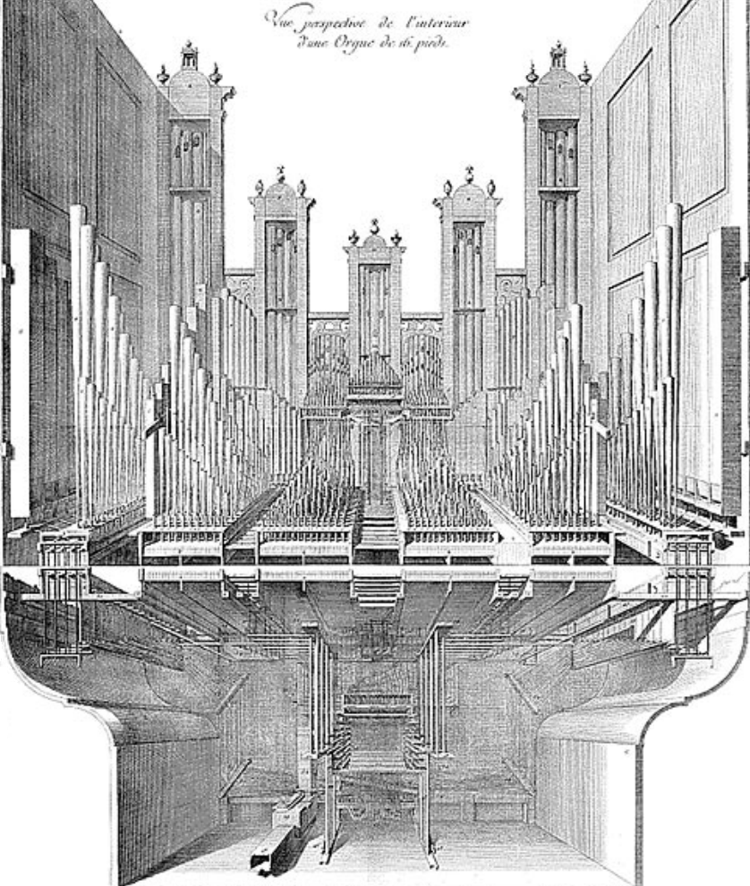
</p>

<p align="center">
  <em>Figura 1.1: Vista esquemática de un órgano de tubos</em>
</p>

Cada división (...) explicaciones.

En la figura 1.2 se puede observar la fachada del órgano de tubos de la Catedral Notre Dame de Paris, detras de la cual se encuentran al rededor de 8000 tubos. En la parte visible, se pueden apreciar los tubos de los registros llamados Montre o Principal (16 pies de alto el más grande) y las trompetas horizontales de alta presión "en chamade".

<p align="center">
  
</p>

<p align="center">
  <em>Figura 1.2: Fachada del órgano de tubos de la Catedral Notre Dame de Paris</em>
</p>

Como es de suponer, existen diversos mecanismos (...) explicación del funcionamiento de órganos de tubos (...).

Para tener una idea de cómo pueden ser utilizadas las funcionalidades anteriormente mencionadas, puede apreciarse en la figura 1.3 la consola del órgano de tubos de la Catedral de Notre Dame de Paris (fachada en la figura 1.2), el más icónico y conocido de todo el mundo. En el centro (...) explicaciones (...) (y otras tantas funcionalidades extra).

<p align="center">
  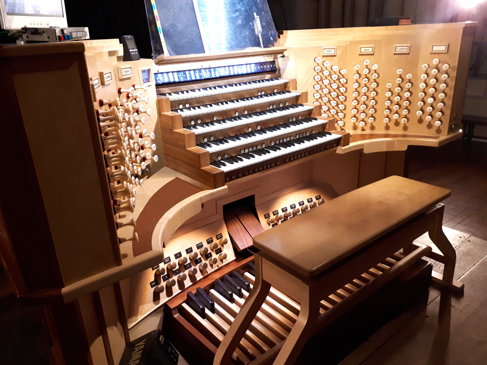
</p>

<p align="center">
  <em>Figura 1.3: Consola del órgano de tubos de la Catedral Notre Dame de Paris</em>
</p>

De esta manera, un organista sin ayudantes es capaz de manejar por completo un órgano de tubos y ejecutar piezas complejas con cambios rápidos y repentinos de registración, gracias al sistema electrónico de gestión. En el video siguiendo el link [1], se puede observar un ejemplo de ejecución en el instrumento mencionado. En este caso, en vez de cambiar los registros y acoples (...) explicaciones de detalles adicionales (...).

## 1.4. Desarrollo de las funcionalidades en el microcontrolador

Para llevar adelante el trabajo, se implementó un gestor cíclico de tareas (...) decision making (...).

Se desarrollaron tres modos de funcionamiento, exec, configuración y Bluetooth.

- (...) flujo (...)

- (...) flujo (...)

- (...) flujo (...)

Por el lado del funcionamiento electrónico externo, (...) decision making (...). Para el caso del servo motor, se controla vía salida PWM variando el duty cycle a frecuencia constante. Para la gestión Bluetooth se utilizó el módulo comercial ESP32 C3, el cual intercambia datos con el microcontrolador vía UART. Se diseñó una app que maneja los modos de funcionamiento descriptos.

Para realizar el trabajo, se implementaron dos manuales de dos notas por octava más nota superior (do, sol, do, sol, do) y pedalera de dos notas mas nota superior (do, sol, do). Cada división cuenta con un registro propio.

# CAPÍTULO 2
# Introducción específica

## 2.1. Requisitos

En la tabla 2.1 se describen las distintas funcionalidades codificadas, agrupadas por módulos.

| Grupo | ID | Descripción |
| :---- | :---- | :---- |
| Interruptores/ Botones / Sensores | 1.1 | El sistema contará con 5 botones en cada uno de los dos manuales, donde cada uno representa una nota musical |
|  | 1.2 | El sistema contará con 3 botones en la pedalera, donde cada uno representa una nota musical |
| Continúa (...) | X.X | (...) La lista completa incluye todos los requisitos (...) |

<p align="center">
  <em>Tabla 2.1: Requisitos del trabajo</em>
</p>

## 2.2. Casos de uso

Los casos de uso para este trabajo son tantos como combinaciones de teclas o botones quiera apretar el usuario. Cada uno de ellos representa (...) flujo (...). Se presentan tres tablas, 2.2, 2.3 y 2.4, cada una con un caso de uso distinto, a modo de ejemplo.

| Elemento | Definición |
| :---- | :---- |
| Disparador | Se quiere ejecutar una nota en el manual I |
| Precondiciones | El sistema se encuentra encendido, se encuentran dos registros seleccionados del manual I, se encuentra un registro en el manual II, se encuentra activado el acople II/I |
| Flujo principal | El sistema (...) flujo (...) |

<p align="center">
  <em>Tabla 2.2: Caso de uso 1</em>
</p>

| Elemento | Definición|
| :---- | :---- |
| Disparador | Se desea setear la combinación libre 2 |
| Precondiciones | El sistema se encuentra encendido, se encuentran dos registros seleccionados del manual I, se encuentra un registro en el manual II, se encuentra activado el acople II/I |
| Flujo principal | Al presionar el boton de set, el sistema lee el pin de set presionado, (...) flujo (...) |

<p align="center">
  <em>Tabla 2.3: Caso de uso 2</em>
</p>

| Elemento | Definición |
| :---- | :---- |
| Disparador | Se desea seleccionar la combinación libre 1 |
| Precondiciones | El sistema se encuentra encendido, en una determinada combinación de registros y acomplamientos |
| Flujo principal | Al presionar el botón de la combinación libre 1, el sistema lee el pin presionado, (...) flujo (...) |

<p align="center">
  <em>Tabla 2.4: Caso de uso 3</em>
</p>

## 2.3. Módulo Bluetooth

Para establecer una conexión Bluetooth con el dispositivo que posee la aplicación diseñada, se utilizó el módulo comercial ESP32 C3 RISC-V [2], el cual se muestra en la figura 2.1, y envía los datos recibidos vía UART a la placa NUCLEO-F103RB y viceversa.

<p align="center">
  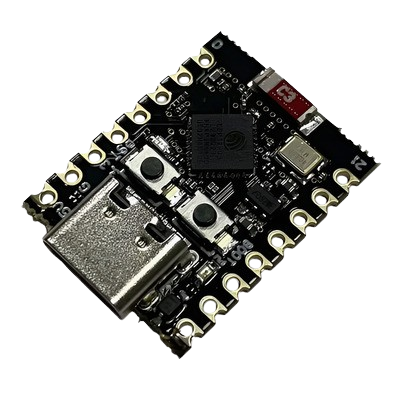
</p>

<p align="center">
  <em>Figura 2.1: Módulo ESP32 C3 RISC-V</em>
</p>

El microcontrolador fue programado en lenguaje Arduino utilizando la librería ESP32 BLE Arduino [3], la cual permite enviar y recibir mensajes Bluetooth Low Energy [4], en especial mensajes MIDI sobre BLE. (...) decision making (...).

La elección de módulo Bluetooth se basó principalmente en el reducido costo (~4 USD), reducido tamaño y novedad en la arquitectura open source (RISC-V [5]).

## 2.4. Shift registers de entrada y salida

Los microcontroladores suelen contar con cantidades muy limitadas de entradas y salidas que se utilizan para múltiples propósitos, las cuales no alcanzan (...) decision making (...).

En particular, por cuestiones de precio, accesibilidad y tamaño, se optó por los integrados 74HC165 y 74HC595, (...) decision making (...), los cuales se presentan en la figura 2.2.

<p align="center">
  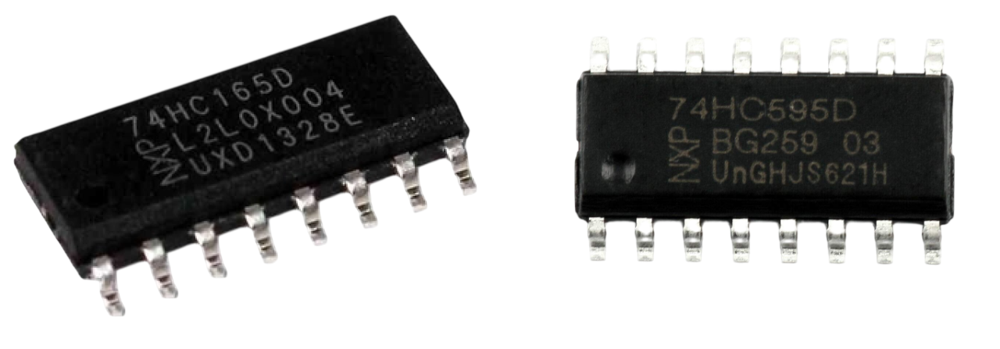
</p>

<p align="center">
  <em>Figura 2.2: Integrados 74HC165D y 74HC595D</em>
</p>

## 2.5. Servomotor

Para la apertura y cierre de las persianas se debe utilizar un servomotor. En el caso del presente trabajo, como se precisa realizar una demostración funcional, se seleccionó el servomotor SG90 por su bajo precio, reducido tamaño y reducido consumo de corriente. En la figura 2.3 se presenta dicho servomotor.

<p align="center">
  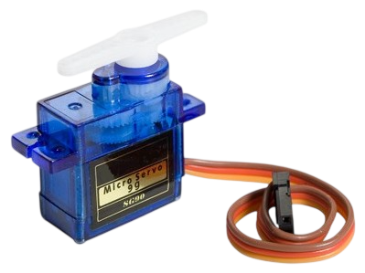
</p>

<p align="center">
  <em>Figura 2.3: Servomotor SG90</em>
</p>

## 2.6. Protocolo MIDI

Para establecer la comunicación entre los dispositivos del trabajo, ya sea un instrumento externo con la placa, la placa con el módulo Bluetooth, o el módulo Bluetooth con la aplicación, se utilizó el protocolo MIDI [6]. La decisión se tomó en base a (...) decision making (...).

# CAPÍTULO 3
# Diseño e implementación

## 3.1. Hardware

En la figura 3.1, se presenta el diagrama en bloques de los periféricos utilizados en el trabajo y su tipo de conexión a la placa NUCLEO-F103RB.

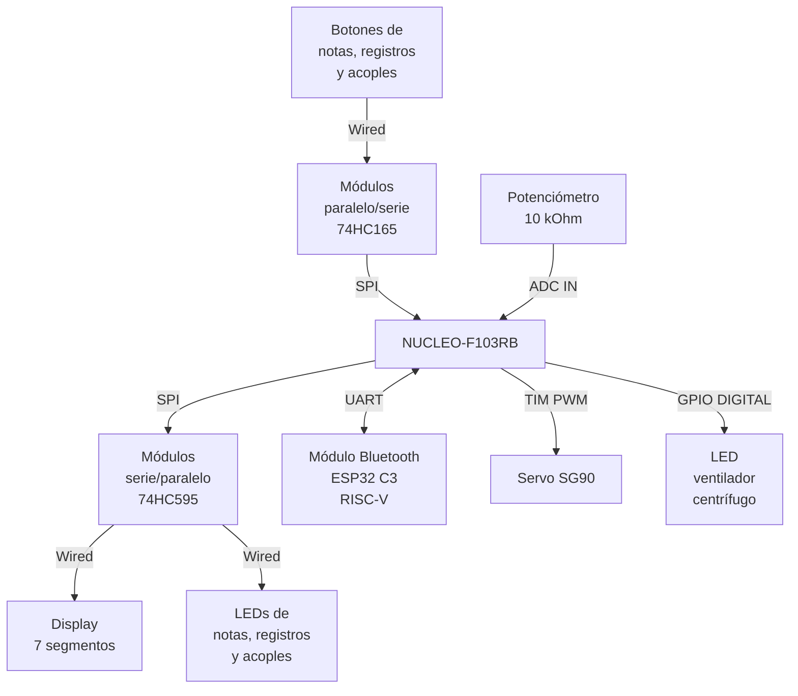
```mermaid
	flowchart TD
	A["NUCLEO-F103RB"]
	
	B["Módulos
	paralelo/serie
	74HC165"] -->|SPI| A

	A -->|SPI| C["Módulos
	serie/paralelo
	74HC595"]

	A <-->|UART| D["Módulo Bluetooth
	ESP32 C3
	RISC-V"]

	E["Potenciómetro
	10 kOhm"] -->|ADC IN| A

	A -->|TIM PWM| F["Servo SG90"]
	
	A -->|GPIO DIGITAL| G["LED
	ventilador
	centrífugo"]
	
	C -->|Wired| I["Display
	7 segmentos"]

	C -->|Wired| H["LEDs de
	notas, registros
	y acoples"]
	
	J["Botones de
	notas, registros
	y acoples"] -->|Wired| B
```

<p align="center">
  <em>Figura 3.1: Diagrama en bloques del sistema</em>
</p>

### 3.1.1. Placa con microcontrolador

El trabajo se desarrolló en torno a la placa NUCLEO-F103RB de STMicroelectronics, la cual cuenta con un procesador ARM 32-bit Cortex-M3 y se puede observar en la figura 3.1.1 Se puede acceder en detalle a las características de la placa siguiendo el link [7].

Se utilizó dicha placa por haber sido la plataforma adoptada por la cátedra en el presente cuatrimestre, la cual cuenta con todas las características necesarias para desarrollar el trabajo. Se la alimentó vía un puerto USB 2.0 de la notebook con que se realizó el trabajo, alcanzando los valores de corriente necesarios para alimentar todos los dispositivos.  

<p align="center">
  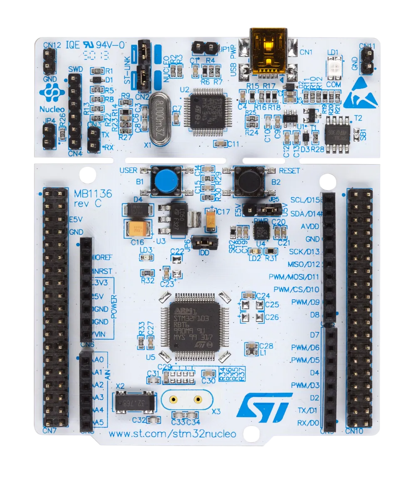
</p>

<p align="center">
  <em>Figura 3.1.1: Placa NUCLEO-F103RB</em>
</p>

### 3.1.2. Potenciómetro

Para la lectura del pedal expresivo se utilizó un potenciómetro lineal de 10 kOhm, el cual se presenta en la figura 3.1.2. (...) detalles de la conexión (...). Para reducir la impedancia de entrada al ADC del microcontrolador, se analizó la posibilidad de armar un circuito basado en un amplificador operacional en configuración seguidor, pero se descartó la idea debido al correcto funcionamiento de la conexión directa del potenciómetro y simplicidad del trabajo.

<p align="center">
  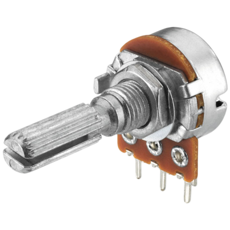
</p>

<p align="center">
  <em>Figura 3.1.2: Potenciómetro lineal de 10 kOhm</em>
</p>

### 3.1.3. LEDs y display de 7 segmentos

Para observar el estado de las notas, registros, acoples, combinaciones libres y todos los componentes desarrollados en el trabajo, se utilizaron LEDs y un display de 7 segmentos, como los mostrados en la figura 3.1.3. (...) detalles de la conexión (...). 

<p align="center">
  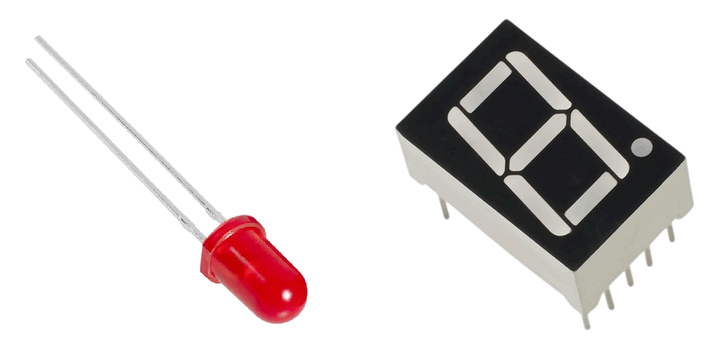
</p>

<p align="center">
  <em>Figura 3.1.3: LED rojo y display de 7 segmentos cátodo común </em>
</p>

### 3.1.4. Botones

Para modificar el estado de las notas, registros, acoples, combinaciones libres y todos los componentes desarrollados en el trabajo, se utilizaron botones de contacto simple como el de la figura 3.1.4. Se los conectó (...) detalles de la conexión (...).

<p align="center">
  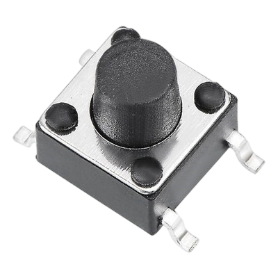
</p>

<p align="center">
  <em>Figura 3.1.4: Switch SMD de contacto simple</em>
</p>

### 3.1.5. Expansor de pines para la entrada

Para seleccionar los expansores de pines de entrada, se presentaron dos opciones, el integrado 74HC165 y el módulo MCP23017. Las principales diferencias son que el MCP2017 es bidireccional, tiene 16 entradas/salidas, avisa con un pin dedicado el cambio en el valor de alguna de las entradas y posee además, resistencias de pull up integradas. En el caso del 74HC165, no se cuenta con dichas opciones disponibles y solo posee 8 entradas.

En Argentina, el precio del primer integrado ronda el valor de 2 USD, el del segundo, ronda los 10 USD. Dado que las únicas ventajas que proporciona el MCP23017 para el presente trabajo son tener 8 pines más y ahorrar la lectura y procesamiento de los 8 pines constantemente, reduciéndolo únicamente al caso en que haya una modificación, se optó por el 74HC165 que (proporcionalmente a la cantidad de pines) cuesta el 40% del valor del MCP23017. El integrado elegido fue presentado en el punto 2.4.

Se los alimentó con los 3,3 V que provee la placa NUCLEO (previo chequeo de compatibilidad con operación en 3,3 V) y (...) detalles de la conexión (...).

### 3.1.6. Expansor de pines para la salida

Para seleccionar los expansores de pines de salida, la opción más barata, accesible y recomendada fueron los integrados 74HC595, presentados en el punto 2.4. Dada su amplia recomendación, bajo costo y funcionalidad básica, no se realizaron más comparaciones para su selección que la del costo.

En Argentina, el valor ronda los 0,5 USD por integrado y comparándolo con el MCP23017 de (proporcionalmente) 4 USD, la diferencia es abismal sin tener ningún tipo de desventaja.

Se los alimentó con los 3,3 V que provee la placa NUCLEO (previo chequeo de compatibilidad con operación en 3,3 V) y (...) detalles de la conexión (...).

### 3.1.7. Módulo Bluetooth

El módulo Bluetooth utilizado ha sido presentado en el punto 2.3. Se lo alimentó con el pin de 5V de la placa NUCLEO y (...) detalles de la conexión (...).

### 3.1.8. Servomotor

El servomotor utilizado ha sido presentado en el punto 2.5. Se lo alimentó con el pin de 5V de la placa NUCLEO, (...) detalles de la conexión (...).

## 3.2. Firmware del microcontrolador

El firmware ha sido desarrolado implementando en lenguaje C un gestor cíclico de tareas con cuatro tareas bajo su control. A excepción de Actuator, cada tarea tiene una interfaz asociada para recibir eventos provenientes de las otras tareas. En la figura 3.2 se presenta un esquema entendible de los bloques principales del firmware. 

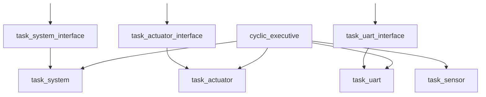
```mermaid
  flowchart TD
  in1[ ]:::inv
  in2[ ]:::inv
  in3[ ]:::inv

  in1 --> F["task_system_interface"]
  in2 --> G["task_actuator_interface"]
  in3 --> H["task_uart_interface"]

  A["cyclic_executive"]

  F --> C["task_system"]
  G --> D["task_actuator"]
  H --> E["task_uart"]

  A --> B["task_sensor"]
  A --> C
  A --> D
  A --> E

  classDef inv fill:none,stroke:none,width:0px,height:0px;
```

<p align="center">
  <em>Figura 3.2: Módulos de software del gestor cíclico de tareas</em>
</p>

El código comienza realmente en el main.c, el cual únicamente inicializa los periféricos y pasa el control a cyclic_executive.c. Seguidamente, cyclic_executive se encarga de inicializar el DWT (Data Watchpoint and Trace) para poder medir el tiempo con alta precisión, posteriormente inicializa todas las tareas, para comenzar a ejecutar todas, cada vez que se produce un SysTick, una vez por milisegundo.

Una vez actualizadas todas las tareas, entra en modo sleep sin suspender el tick del sistema, dejando los relojes de los periféricos y de la SRAM activos para continuar de forma correcta las transferencias vía DMA presentes en cada tarea. De esa manera, espera la siguiente interrupción para volver a actualizar las tareas y así ahorrar energía en el intervalo libre. Si la interrupción ocurre debido a la finalización de una transferencia DMA, continúa el ciclio sin actualizar las tareas ya que g_cyclic_executive_tick_cnt es 0 y vuelve a entrar en modo sleep.

Cyclic_executive se encarga también de medir el peor tiempo de ejecución (WCET) de cada tarea, contando el tiempo que le lleva a cada una actualizarse, cada vez que da dicha orden. Esto permite mantener los márgenes de ejecución de cada tarea dentro de un marco lo más estable y predecible posible.

Hasta el presente punto, se trabajó de igual manera que se lo hizo durante la cursada, el código es completamente estándard, sin particularidades.

### 3.2.1. Tarea Sensor

En la tarea Sensor, se desarrollaron dos tipos de máquinas de estados, la primera para los botones (una para cada botón) y la segunda para la lectura del ADC.

En el caso de los botones, antes de entrar a la máquina de estados, (...) código de la tarea Sensor (...).

```C
(...) código de la tarea Sensor (...)
```

<p align="center">
  <em>Código 3.2.1: Código para interpretación de la lectura vía DMA</em>
</p>

Para los botones, las máquinas de estados cuentan con cuatro estados para realizar el debouncing correspondiente. Se pasa primero por FALLING y RISING previo a pasar de UP a DOWN y viceversa, como se puede observar en la figura 3.2.1 De cambiar los botones y experimentar bouncing, se puede agregar un tick intermedio para ampliar el tiempo de filtrado.

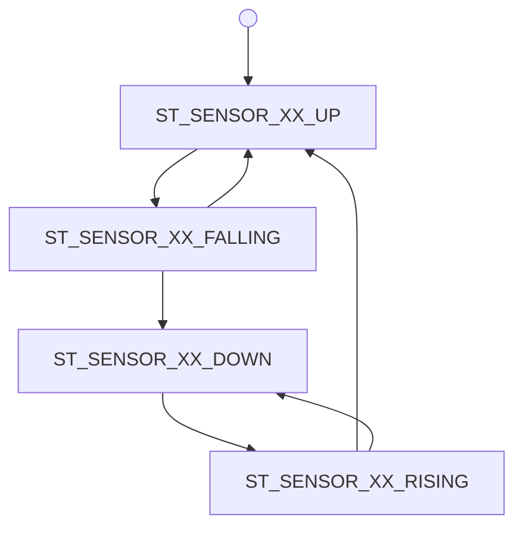
```mermaid
	flowchart TD
	A["ST_SENSOR_XX_UP"]

	A --> B["ST_SENSOR_XX_FALLING"]

	B --> C["ST_SENSOR_XX_DOWN"]

	C --> D["ST_SENSOR_XX_RISING"]

	B --> A

	D --> A

	D --> C

	hidden(( )) --> A
```

<p align="center">
  <em>Figura 3.2.1: Estados posibles de las máquinas de estados de los botones</em>
</p>

En el caso del ADC, se realiza una técnica similar adaptada al caso, creando una banda de filtrado. Únicamente al leer un valor fuera de la banda se actualiza el valor.

Dichas máquinas de estados envían a la tarea System (...) código de la tarea Sensor (...). Como se observa en el código 3.2.2, esto último se lo realiza desplazando 5 bits para ahorrar recursos en el procesador.

```C
uint32_t expr_midi_map = p_task_sensor_dta->value_prev >> 5;
put_event_task_system(p_task_sensor_adc_cfg->signal, (task_system_id_t)expr_midi_map);
```

<p align="center">
  <em>Código 3.2.2: Código para el mapeo del valor del ADC de 12 a 7 bits</em>
</p>

La lectura del valor del ADC se realiza vía DMA previo a concluir la función de sensor_update() para evitar retrasos y tener la información disponible en el próximo update, un milisegundo después. La información se deposita en la variable adc_buffer, de la cual se copia su valor dentro de la máquina de estados previo a su procesamiento, para evitar errores de lectura múltiple de una variable única, de producirse un callback en el momento de la ejecución de la máquina de estados del ADC.

Para leer el estado de (...) código de la tarea Sensor (...) para no interferir la operación en curso. Lo anteriormente comentado se observa en el código 3.2.3

```C
// el DMA compartido lo maneja actuator
if (false == busy_spi)
{
  // pulso para cargar el estado de los botones a los 165 y procesar en el siguiente tick
  HAL_GPIO_WritePin(L165_PORT, L165_PIN, L165_LOAD);
  HAL_GPIO_WritePin(L165_PORT, L165_PIN, L165_IDLE);
}

// medir el ADC para en el proximo tick procesarlo
HAL_ADC_Start_DMA(&hadc1, (uint32_t*)adc_buffer, ADC_DTA_QTY);
```

<p align="center">
  <em>Código 3.2.3: Código para la lectura DMA del ADC y el load de los 74HC165</em>
</p>

### 3.2.2. Tarea System

En la tarea System se desarrolló la lógica de funcionamiento del órgano de tubos, con todos las funcionalidades descriptas en la tabla 2.1. Se creó una única máquina de estados con los tres estados de funcionamiento del órgano, a saber, EXEC, CFG y BT, como se muestra en la figura 3.2.2.

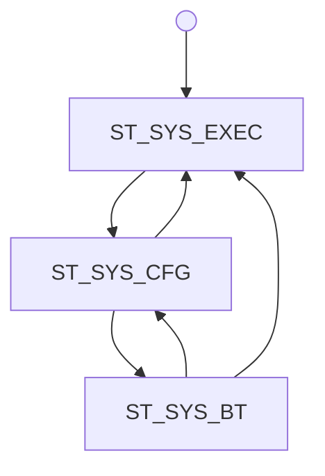
```mermaid
	flowchart TD
	A["ST_SYS_EXEC"]

	A --> B["ST_SYS_CFG"]

	B --> C["ST_SYS_BT"]

	B --> A

	C --> B

	C --> A

	hidden(( )) --> A
```

<p align="center">
  <em>Figura 3.2.2: Estados posibles de la máquina de estados de System</em>
</p>

La máquina de estados se vale de (...) detalles del código de la tarea System (...).

Todas las funcionalidades explicadas anteriormente fueron (...) detalles del código de la tarea System (...) y adicionarle posteriormente los casos posibles funcionando en conjunto con los otros módulos.

### 3.2.3. Tarea Actuator

En la tarea Actuator (...) detalles del código de la tarea Actuator (...) y el seteo del valor del timer 3 que controla la salida PWM hacia el servomotor. Los estados de la máquina de estados de las salidas se muestran en la figura 3.2.3.

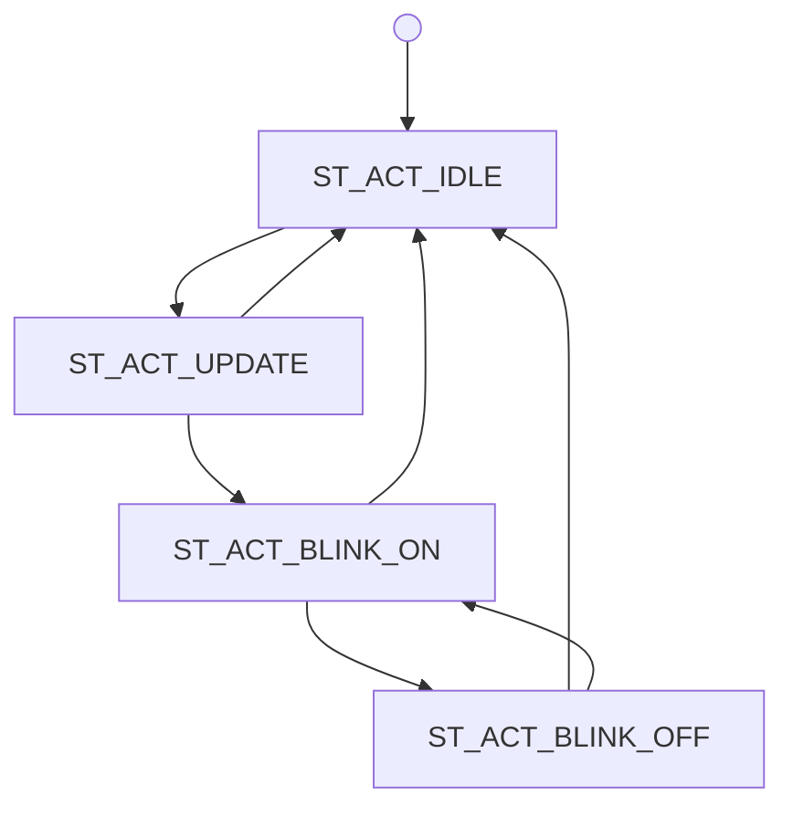
```mermaid
	flowchart TD
  A["ST_ACT_IDLE"]

	A --> B["ST_ACT_UPDATE"]

	B --> C["ST_ACT_BLINK_ON"]

	C --> D["ST_ACT_BLINK_OFF"]

	B --> A

	C --> A

	D --> A

	D --> C

	hidden(( )) --> A
```

<p align="center">
  <em>Figura 3.2.3: Estados posibles de la máquina de estados de Actuator</em>
</p>

La tarea Actuator (...) detalles del código de la tarea Actuator (...), el cual se envía posteriormente vía SPI, con la llamada DMA correspondiente. Lo anteriormente descripto se presenta en el código 3.2.4.

```C
if (false == busy_spi)
{
  (...) código de la tarea Actuator (...)
}
```

<p align="center">
  <em>Código 3.2.4: Código para el envío por DMA (...)</em>
</p>

Terminada la transferencia DMA (...) detalles del código de la tarea Actuator (...) para permitir la lectura de los integrados y nuevas transferencias, como se observa en el código 3.2.5.

```C
void HAL_SPI_TxRxCpltCallback(SPI_HandleTypeDef *hspi) {
  if (hspi->Instance == SPI2)
	{
		(...) código de la tarea Actuator (...)
  }
}
```

<p align="center">
  <em>Código 3.2.5: Código de callback DMA</em>
</p>

Por útlimo, de recibir un update del servomotor, su máquina de estados actualiza el timer con el nuevo valor del duty cycle PWM a una frecuencia de 50 Hz, según los valores establecidos para el modelo SG90, como se ve en el código 3.2.6 presentado a continuación.

```C
void task_actuator_set_pwm(uint32_t value)
{
	// TIMER3 PSC 719 ARR de 1999
	uint32_t pulse = 50 + (value * (240-50) / 127);

	// ARR * (pulso/periodo PWM servo SG90)
    if (pulse < 50)  pulse = 50; // pulso de 0.5 ms -> 1999 * (0.5 ms / 20 ms) aprox 50
    if (pulse > 240) pulse = 240; // pulso de 2.4 ms -> 1999 * (2.4 ms / 20 ms) aprox 240
	__HAL_TIM_SET_COMPARE(&htim3, TIM_CHANNEL_1, (uint16_t)pulse);
}
```

<p align="center">
  <em>Código 3.2.6: Código para el seteo del timer 3 con el duty cycle correspondiente</em>
</p>

### 3.2.4. Tarea UART

En la última tarea, UART, se desarrolló la lógica de envío y recepción de datos por dicho medio. (...) detalles del código de la tarea UART (...). Lo anteriormente explicado se presenta en el código 3.2.7.

```C
void task_uart_tx_write_midi_msg(uint8_t *msg, bool two_byte, uint8_t uart_number)
{
	(...) código de la tarea UART (...)
}

void task_uart_tx_send(uint8_t uart_number)
{
  (...) código de la tarea UART (...)
}
```

<p align="center">
  <em>Código 3.2.7: Código para la carga de mensajes MIDI en el buffer DMA y su posterior envío</em>
</p>

Por último, el callback UART que indica la finalización del envío (...) detalles del código de la tarea UART (...) buffer sin problemas. La implementación se puede observar a continuación en el código 3.2.8.

```C
void HAL_UART_TxCpltCallback(UART_HandleTypeDef *huart)
{
  (...) código de la tarea UART (...)
}
```

<p align="center">
  <em>Código 3.2.8: Código para la actualización del tail del buffer DMA en dicho callback</em>
</p>

Para la recepción de mensajes vía UART, (...) código de la tarea UART (...) que se muestra en el código 3.2.9 (...) código de la tarea UART (...).

```C
void UART_IDLE_Callback(UART_HandleTypeDef *huart, uint8_t uart_number)
{
	(...) código de la tarea UART (...)
}
```

<p align="center">
  <em>Código 3.2.9: Código de callback DMA</em>
</p>

Por último, (...) código de la tarea UART (...) en la interfaz de System.

## 3.3. Firmware del módulo Bluetooth

El módulo Bluetooth fue codificado en lenguaje Arduino utilizando la librería ESP32 BLE Arduino, como se comentó en el punto 2.3.

El código (...) detalles de diseño del firmware del módulo Bluetooth (...).

El firmware utiliza el prácticamente el mismo código implementado en la placa NUCLEO para decodificar los mensajes MIDI y reenviarlos correspondientemente.

## 3.4. Firmware de la aplicación

La aplicación fue codificada en lenguaje Dart utilizando el framework Flutter, ambos desarrollados por Google, para poder compilar el mismo código en las distintas plataformas. Se utilizó (...) detalles de diseño de la aplicación (...) y se compiló la aplicación para Android, dadas las dificultades encontradas (suscripción paga, macbook, certificados, etc) para instalar en iOS la aplicación desarrollada.

Se creó la interfaz gráfica como se observa en la figura 3.3, y se le asignaron las funciones correspondientes según la tabla 2.1, utilizando prácticamente el mismo código de codificación/decodificación MIDI empleado en el microcontrolador.

<p align="center">
  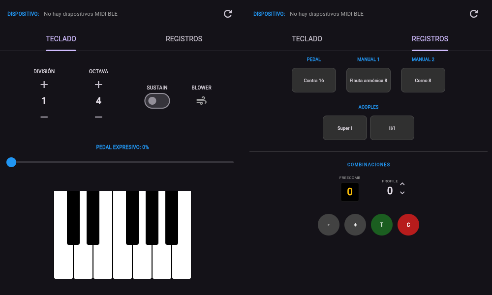
</p>

<p align="center">
  <em>Figura 3.3: Interfaz gráfica de la aplicación</em>
</p>

El backend reacciona ante streams de mensajes MIDI BLE y los procesa cada 16 milisegundos (60 Hz), actualizando la interfaz gráfica a 24 Hz para mostrar únicamente en pantalla datos recibidos vía MIDI BLE.

Al presionar los botones, (...) detalles de diseño de la aplicación (...) que provocan la actualización de la interfaz gráfica con la información correspondiente.

# CAPÍTULO 4
# Ensayos y resultados

## 4.1. Pruebas funcionales del hardware

Tres veces se recurrió a realizar pruebas estrictamente sobre el hardware, debido a que se trabajó principalmente realizando pruebas de integración a medida que se fue avanzando el trabajo.

El primer módulo que se testeó fue el Bluetooth, como se muestra en la figura 4.1. Se cargó un código básico, comprobando que funcionó correctamente el envío y la recepció vía UART con el microcontrolador. Posteriormente se armó el esqueleto del código para el módulo y se pasó directamente a las pruebas de integración.   

<p align="center">
  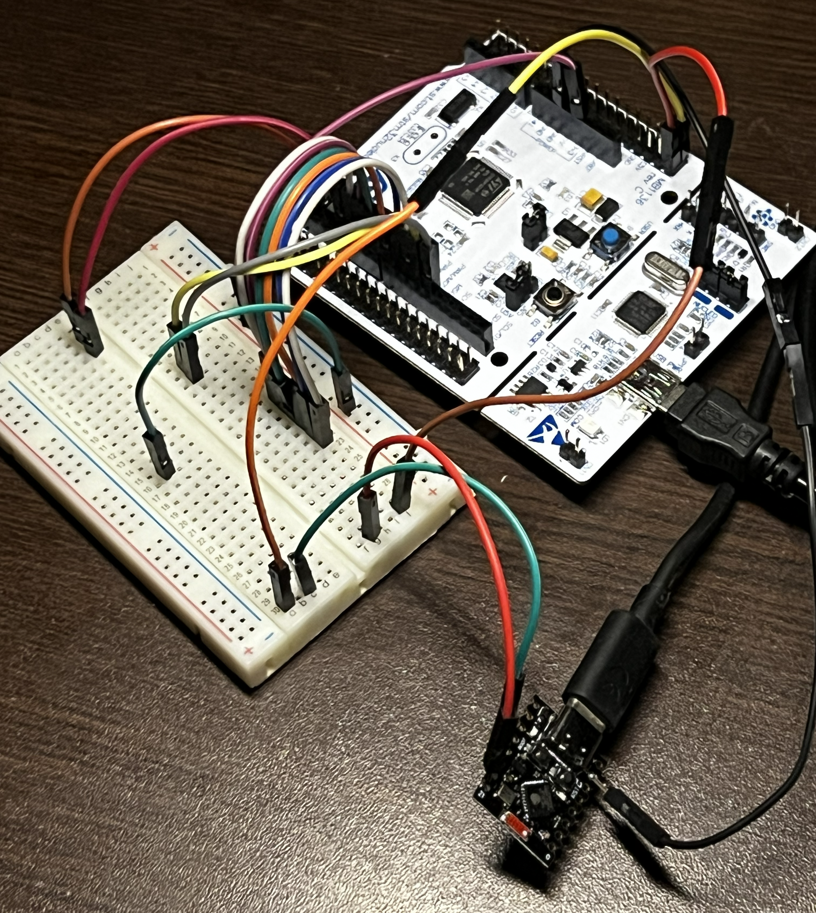
</p>

<p align="center">
  <em>Figura 4.1: Test de hardware del módulo Bluetooth</em>
</p>

Los dos módulos que se testearon por separado fueron los integrados 74HC165D y 74HC595D. Se soldaron en una placa conversora SOP16 a DIP16, como se ve en la figura 4.2, y se probó su correcto funcionamiento con una pequeña porción de código. Se detectó una falla en la lógica de interconexión de los módulos en el caso del 74HC165D, se corrigió y se pasó a las pruebas de integración.

<p align="center">
  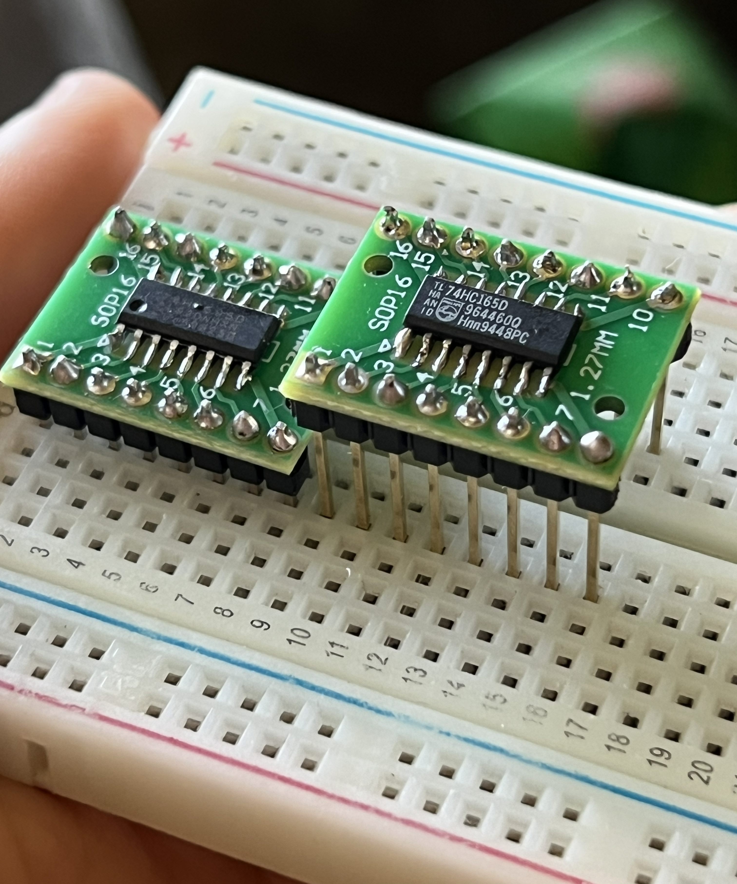
</p>

<p align="center">
  <em>Figura 4.2: Test de hardware de los integrados 74HC165D y 74HC595D</em>
</p>

## 4.2. Pruebas funcionales del firmware

El firmware fue testeado en innumerables etapas a medida que se fue desarrollando el código. Las pruebas excusivamente de firmware están catalogadas con el tag "debugging". Una prueba exclusivamente de software se presenta en la imagen 4.3.

<p align="center">
  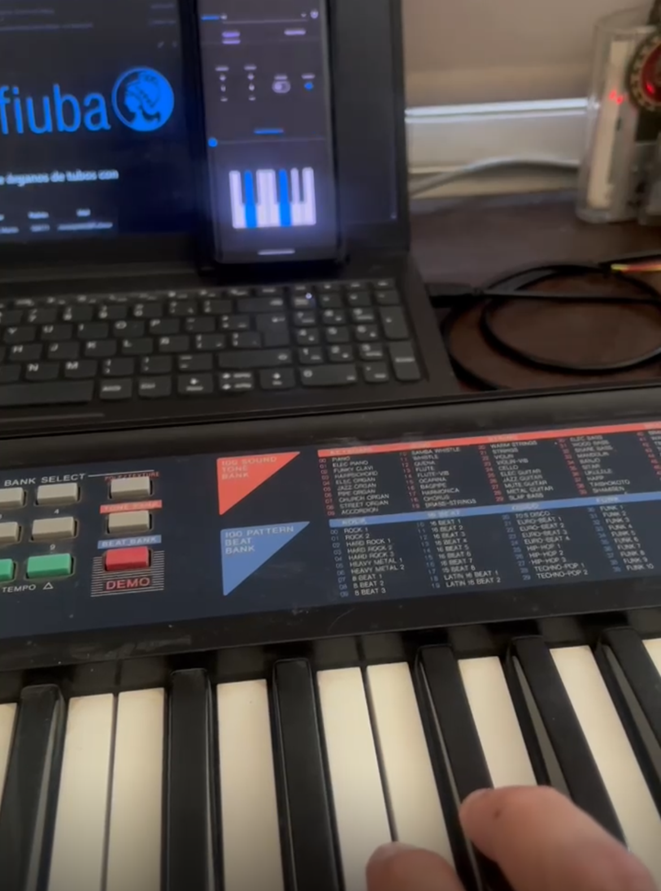
</p>

<p align="center">
  <em>Figura 4.3: Prueba del funcionamiento MIDI sobre BLE en la aplicación desarrollada</em>
</p>

## 4.3. Pruebas de integración

Las pruebas de integración se realizaron constantemente a medida que se fue desarrollando el trabajo y no se tomaron registros específicos de cada prueba o medición, sino que buscó la raíz del problema y su solución lo más inmediata posible en el código. En las figuras 4.4, 4.5 y 4.6 se pueden observar tres distintas pruebas de integración realizadas durante el desarrollo del trabajo.

<p align="center">
  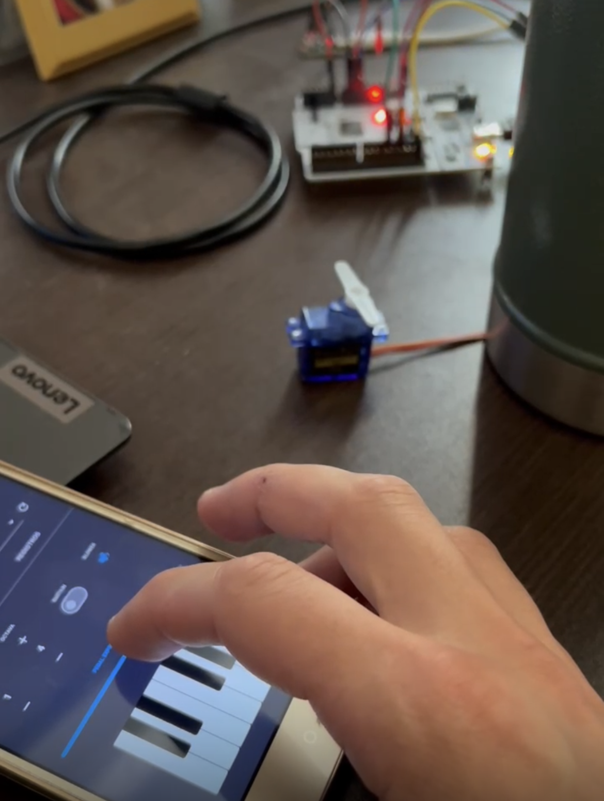
</p>

<p align="center">
  <em>Figura 4.4: Prueba de respuesta del servomotor al control desde la aplicación</em>
</p>

<p align="center">
  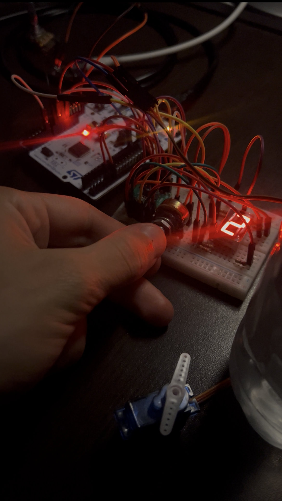
</p>

<p align="center">
  <em>Figura 4.5: Prueba de lectura del ADC, movimiento del servomotor y encendido del display de 7 segmentos</em>
</p>

<p align="center">
  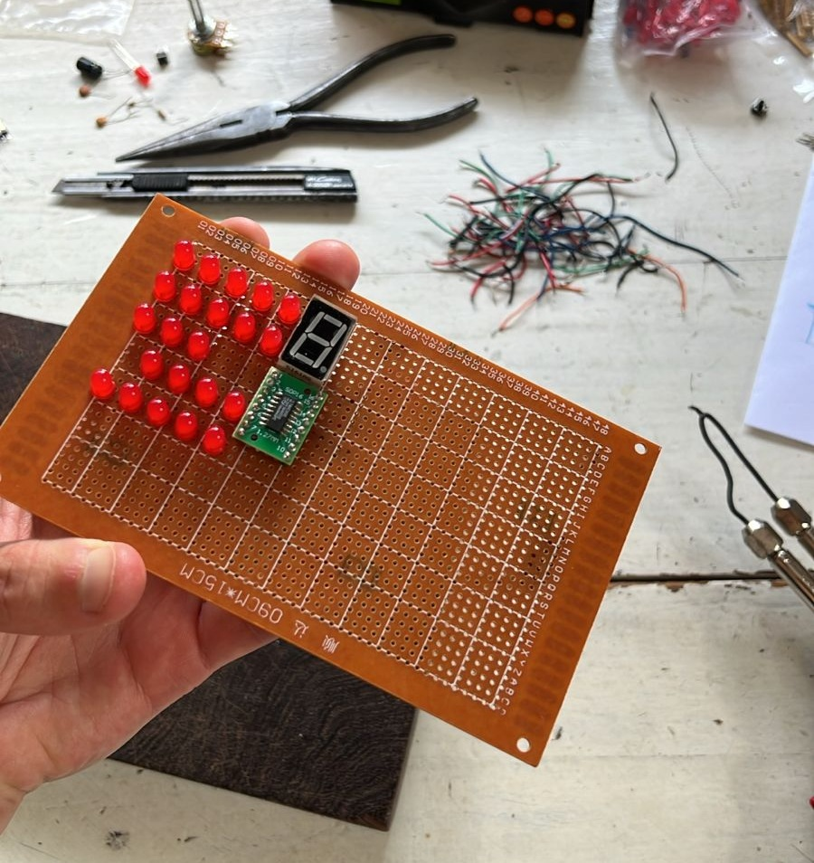
</p>

<p align="center">
  <em>Figura 4.6: Prueba de encendido de leds individuales</em>
</p>

En la figura 4.7 se presenta la utilización de recursos del microcontrolador, detallando la cantidad de memoria RAM y FLASH utilizada.

<p align="center">
  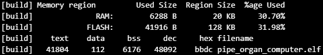
</p>

<p align="center">
  <em>Figura 4.7: Utilización de recursos del microcontrolador</em>
</p>

En el video que se encuentra siguiendo el link [8], se presenta la prueba de integración definitiva, en donde se puede observar todas las características del sistema completo funcionando.

## 4.4. Circuito esquemático

En la figura 4.8 se presenta el circuito esquemático del sistema completo.

<p align="center">
  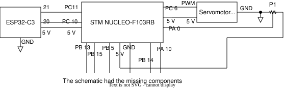
</p>

<p align="center">
  <em>Figura 4.8: Circuito esquemático del sistema</em>
</p>

En el circuito esquemático:

- (...) detalles del circuito esquemático (...)
- (...) más detalles del circuito esquemático (...)

En las tablas 4.1 y 4.2 se establecen (...) detalles de diseño (...). Las entradas y salidas marcadas como libres se reservan para posibles casos de expansión.

(...) Estaba la tabla de inputs (...)

<p align="center">
  <em>Tabla 4.1: Pines de entrada de los integrados 74HC165D</em>
</p>

(...) Estaba la tabla de outputs (...)

<p align="center">
  <em>Tabla 4.2: Pines de salida de los integrados 74HC595D</em>
</p>

## 4.5. Medición y análisis del consumo energético

Se realizaron mediciones para analizar el consumo energético de los módulos que componen el sistema.

Se los dividó en dos partes debido a la forma en la que se realizaron las mediciones.

 - Sistemas 3,3 V
 - Sistemas 5 V

La placa NUCLEO posee un jumper (JP6) [9], el cual puede ser quitado y colocar en su lugar un amperímetro intermedio. De esa manera, se puede medir la corriente suministrada tanto al microcontrolador como a los componentes o módulos conectados al pin 3,3 V.

Como a dicho pin se encuentran conectados los 74HC165, 74HC595 y el potenciómetro de 10 kOhm, los resultados presentados corresponden al consumo de corriente del microcontrolador sumado a los de dichos integrados junto con todos los componentes que obtienen corriente de ellos (LEDs, display de 7 segmentos). En la tabla 4.3 se observan los resultados sin activar el modo sleep y en la 4.4, con dicho modo activo.

<table align="center">
  <tr>
    <th>N° de medición</th>
    <th>Valor medido</th>
    <th>Estado</th>
  </tr>
  <tr>
    <td align="center">1</td>
    <td>31 mA</td>
    <td>Estado inicial</td>
  </tr>
  <tr>
    <td align="center">2</td>
    <td>52 mA</td>
    <td>Presionando tres notas</td>
  </tr>
  <tr>
    <td align="center">3</td>
    <td>113 mA</td>
    <td>Presionando cinco notas con tutti activo</td>
  </tr>
</table>

<p align="center">
  <em>Tabla 4.3: Mediciones de corriente en el pin 3,3 V sin modo sleep</em>
</p>

<table align="center">
  <tr>
    <th>N° de medición</th>
    <th>Valor medido</th>
    <th>Estado</th>
  </tr>
  <tr>
    <td align="center">1</td>
    <td>17 mA</td>
    <td>Estado inicial</td>
  </tr>
  <tr>
    <td align="center">2</td>
    <td>39 mA</td>
    <td>Presionando tres notas</td>
  </tr>
  <tr>
    <td align="center">3</td>
    <td>102 mA</td>
    <td>Presionando cinco notas con tutti activo</td>
  </tr>
</table>

<p align="center">
  <em>Tabla 4.4: Mediciones de corriente en el pin 3,3 V con modo sleep activo</em>
</p>

Los valores medidos reflejan el cambio de consumo que produce el modo sleep, especialmente cuando el factor de uso de CPU es bajo (idle, cercano al 8%) y no están prendidos muchos LEDs, los cuales consumen valores constantes de corriente (en este caso, aproximadamente 5 mA por LED). A pesar de la reducción del tiempo activo del CPU, la diferencia de consumo no es sustancial debido a que los periféricos se encuentran encendidos constantemente.

Las mediciones se encuentran dentro del rango recomendado de operación para dicho pin, por debajo de los 300 mA.

En la tabla 4.5 se presentan las mediciones de corriente de los componentes/módulos restantes, los cuales se encuentran conectados al pin de 5 V (módulo Bluetooth, servomotor). Para medir dicha corriente, se intermedió la alimentación desde el pin de 5 V con un amperímetro, midiendo de esa forma, la corriente total suministrada a los mencionados componentes/módulos.

<table align="center">
  <tr>
    <th>N° de medición</th>
    <th>Valor medido</th>
    <th>Estado</th>
  </tr>
  <tr>
    <td align="center">1</td>
    <td>24 mA</td>
    <td>Bluetooth apagado y servo quieto</td>
  </tr>
  <tr>
    <td align="center">2</td>
    <td>68 mA</td>
    <td>Conexión activa ocupada y servo quieto</td>
  </tr>
  <tr>
    <td align="center">3</td>
    <td>186 mA</td>
    <td>Conexión activa ocupada y servo en movimiento</td>
  </tr>
</table>

<p align="center">
  <em>Tabla 4.5: Mediciones de corriente en el pin 5 V</em>
</p>

Las suma de las dos peores mediciones (tanto del pin de 3,3 V como el de 5 V, ya que el regulador de tensión obtiene la corriente del pin 5 V), se encuentran dentro del rango recomendado de operación para la alimentación USB para una PC estándard, por debajo de los 500 mA.

Las mediciones fueron realizadas con un multímetro digital DT830D genérico [10] en modo medición de corriente contínua.

## 4.6. Medición y análisis de tiempos de ejecución

Para medir peor tiempo de ejecución (WCET) de cada tarea, se utilizó el DWT (Data Watchpoint and Trace), el cual permite medir el tiempo con alta precisión. El código programa comienza a contar el tiempo con precisión desde que cada tarea se ejecuta hasta que finaliza. Si el valor obtenido es mayor que el anteriormente guardado, se actualiza el registro, de lo contrario, se continúa sin guardar el valor.

Por otro lado, se realiza la medición del tiempo de ejecución total o factor de utilización de la CPU (en porcentaje), sumando los tiempos de ejecución de cada tarea y luego comparándolos con el tiempo entre ticks. De esa manera, se puede obtener un porcentaje de tiempo en que el microcontrolador se encuentra realizando tareas. Se guarda también el peor caso para tener una referencia de los rangos de tiempo que maneja el programa frente a los distintos casos de uso.

En la figura 4.9 se presentan los datos obtenidos en modo debug, luego de haber sometido al sistema a los distintos casos de uso posibles, siendo la tarea 0, UART, la tarea 1, Sensor, la tarea 2, System, y la tarea 3, Actuator. De esta manera se logró conocer cuáles son los tiempos reales de ejecución junto con los peores casos.

<p align="center">
  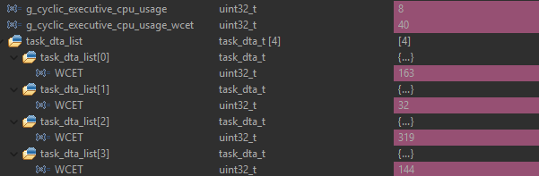
</p>

<p align="center">
  <em>Figura 4.9: WCET de cada tarea y del factor de utilización</em>
</p>

Se puede observar que el factor de utilización sin realizar acciones se encuentra en torno al 8%, mientras que el peor registro se encuentra cercano al 40%. En el caso de las tareas, se puede observar que System emplea el mayor tiempo en realizar sus acciones, como era de esperar.

Lo analizado con anterioridad refleja que se ha tomado la decisión correcta al momento de elegir microcontrolador ya que logra realizar todas las tareas con un factor de utilización de aproximadamente el 50%, que es lo mismo decir, a la mitad de su capacidad.

## 4.7. Cumplimiento de requisitos

En las tablas 4.6 y 4.7 se presenta el grado de cumplimiento de cada uno de los requisitos presentados para el trabajo.

<table align="center">
  <tr>
    <th>Estado</th>
    <th>Descripción</th>
  </tr>
  <tr>
    <td align="center">🟢</td>
    <td>Implementado</td>
  </tr>
  <tr>
    <td align="center">🔴</td>
    <td>No será implementado</td>
  </tr>
</table>

<p align="center">
  <em>Tabla 4.6: Descripción de los íconos de estado</em>
</p>

| Grupo | ID | Descripción | Estado |
| :---- | :---- | :---- | :---- |
| Interruptores/ Botones / Sensores | 1.1 | El sistema contará con 5 botones en cada uno de los dos manuales, donde cada uno representa una nota musical | 🟢 |
|  | 1.2 | El sistema contará con 3 botones en la pedalera, donde cada uno representa una nota musical | 🟢 |
| Continuaba (...) | X.X | (...) La lista completa incluía todos los requisitos (...)|  🟢 |

<p align="center">
  <em>Tabla 4.7: Grado de cumplimiento de los requisitos del trabajo</em>
</p>

## 4.8. Comparación con otros sistemas similares

(...) Comparación resaltando principalmente ventajas de este sistema con respecto a otros (...)

## 4.9. Documentación del desarrollo realizado

En la tabla 4.8 se presentan los elementos que resumen la información más importante a tener en cuenta a la hora de revisar el trabajo y entender qué, por qué y cómo se realizó. 

<table align="center">
  <tr>
    <th>Elemento</th>
    <th>Referencia</th>
  </tr>
  <tr>
    <td>Por qué se realizó el trabajo</td>
    <td>1.2</td>
  </tr>
  <tr>
    <td>Requisitos </td>
    <td>2.1</td>
  </tr>
  <tr>
    <td>Casos de uso</td>
    <td>2.2</td>
  </tr>
  <tr>
    <td>Diagrama de los módulos de hardware</td>
    <td>3.1</td>
  </tr>
  <tr>
    <td>Lista de materiales</td>
    <td>3.1.1 - 3.1.8</td>
  </tr>
  <tr>
    <td>Desarrollo del firmware</td>
    <td>3.2</td>
  </tr>
  <tr>
    <td>Testing</td>
    <td>4.1 - 4.3</td>
  </tr>
    <tr>
    <td>Circuito esquemático</td>
    <td>4.4</td>
  </tr>
    </tr>
    <tr>
    <td>Mediciones y análisis</td>
    <td>4.5 - 4.6</td>
  </tr>
  <tr>
    <td>Grado de cumplimiento de los requisitos iniciales</td>
    <td>4.7</td>
  </tr>
</table>

<p align="center">
  <em>Tabla 4.8: Elementos que resumen la información más importante del trabajo</em>
</p>

# CAPÍTULO 5
# Conclusiones

## 5.1. Resultados obtenidos

Los principales aportes del trabajo realizado son los siguientes:

- Haber aprendido a desarrollar un sistema embebido de forma ordenada y estandarizada.
- Haber aprendido a optimizar código para realizar las tareas de forma más eficiente.
- Haber aprendido a utilizar la mayor cantidad de funcionalidades que presenta el microcontrolador para lograr mayores y más estables velocidades de ejecución.
- Haber aprendido a documentar de forma detallada los pasos realizados.
- Haber aprendido a aplicar los distintos protocolos presentes en el trabajo.
- Haber comenzado a trabajar con componentes SMD.
- Haber tenido que familiarizarse con la revisión eficiente de hojas de datos.
- Haber aprendido a utilizar gestores de versiones de forma habitual.

## 5.2. Próximos pasos

(...) Próximos pasos a implementar para expandir el alcance del trabajo (...)

# Bibliografía

El trabajo se realizó exclusivamente con las presentaciones y ejemplos provistos por la cátedra, y consultas varias a las distintas IA.

\[1\] Notre-Dame organ, Yves Castagnet plays Dupré Prelude & fugue in B major (June 2017). [Online]. Available: https://www.youtube.com/watch?v=9HskcJlixGs

\[2\] Módulo Bluetooth ESP32 C3 RISC-V. [Online]. Available: https://www.espressif.com/en/products/socs/esp32-c3

\[3\] Librería ESP32 BLE Arduino. [Online]. Available: https://docs.arduino.cc/libraries/esp32-ble-arduino

\[4\] The Bluetooth Low Energy Primer. [Online]. Available: https://www.bluetooth.com/bluetooth-le-primer

\[5\] RISC-V Ratified Specification. [Online]. Available: https://riscv.org/specifications/ratified

\[6\] MIDI Specifications. [Online]. Available: https://midi.org/specs

\[7\] Placa NUCLEO-F103RB. [Online]. Available: https://os.mbed.com/platforms/ST-Nucleo-F103RB

\[8\] Presentación del trabajo final. [Online]. Available: https://youtu.be/HGJKOISGU5c

\[9\] MB1136 - Electrical Schematic - STM32 Nucleo-64 boards. [Online]. Available: https://www.st.com/resource/en/schematic_pack/mb1136-default-c04_schematic.pdf

\[10\] Multímetro digital DT830D. [Online]. Available: https://noganet.ar/productos/dt-830d-tester-digital