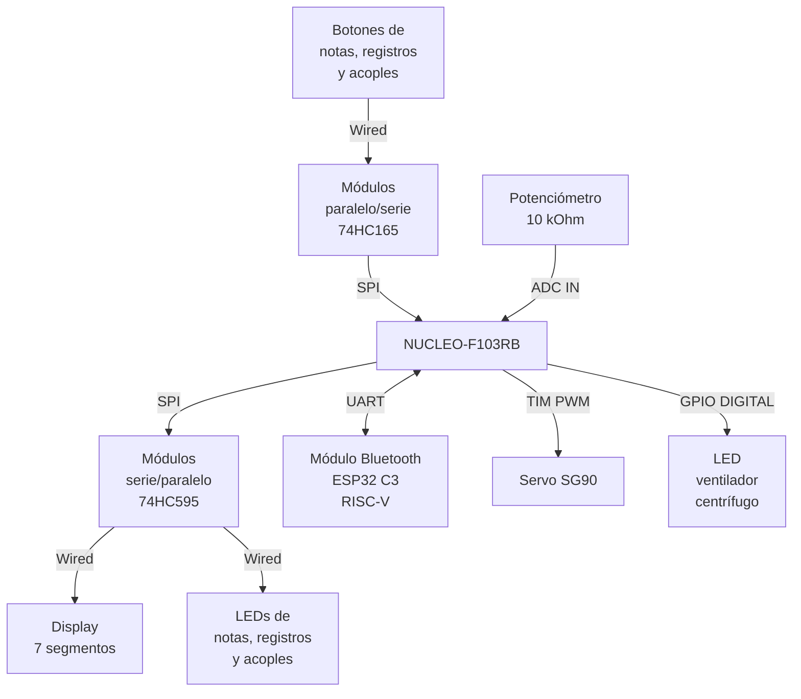



  

# Sistema de gestión de órganos de tubos con microcontroladores

<table align="center">
  <tr>
    <th>Autor</th>
    <th>Padrón</th>
    <th>Mail</th>
  </tr>
  <tr>
    <td>Costantini, Martín</td>
    <td>104171</td>
    <td>mcostantini@fi.uba.ar</td>
  </tr>
  <tr>
    <td>Díaz, Mateo Fermín</td>
    <td>110629</td>
    <td>mfdiaz@fi.uba.ar</td>
  </tr>
</table>

  2025 | 2do Cuatrimestre

  Taller de Sistemas Embebidos (TA134)

  Universidad de Buenos Aires | Facultad de Ingeniería

# 1. Selección del proyecto a implementar y descripción

## 1.1. Objetivo del proyecto

El objetivo del presente proyecto es implementar un sistema completo y moderno de control de órganos de tubos que permita al usuario ejecutarlo desde la consola, desde una app vía Bluetooth, provea recursos para facilitar la ejecución del mismo y herramientas para mejorar la eficiencia a la hora de realizarle mantenimiento.

## 1.2. Funcionamiento de un órgano de tubos

Los órganos de tubos (...) explicación del funcionamiento de órganos de tubos (...)

En la figura 1.1 se puede observar una vista en corte, ilustrativa, de un órgano de tubos mecánico, en donde se aprecian las hileras de tubos.

  

  <em>Figura 1.1: Vista esquemática de un órgano de tubos</em>

Cada división (...) explicaciones.

En la figura 1.2 se puede observar la fachada del órgano de tubos de la Catedral Notre Dame de Paris, detras de la cual se encuentran al rededor de 8000 tubos. En la parte visible, se pueden apreciar los tubos de los registros llamados Montre o Principal (16 pies de alto el más grande) y las trompetas horizontales de alta presión "en chamade".

  

  <em>Figura 1.2: Fachada del órgano de tubos de la Catedral Notre Dame de Paris</em>

Como es de suponer, existen diversos mecanismos (...) explicación del funcionamiento de órganos de tubos (...).

Para tener una idea de cómo pueden ser utilizadas las funcionalidades anteriormente mencionadas, puede apreciarse en la figura 1.3 la consola del órgano de tubos de la Catedral de Notre Dame de Paris (fachada en la figura 1.2), el más icónico y conocido de todo el mundo. En el centro (...) explicaciones (...) (y otras tantas funcionalidades extra).

  

  <em>Figura 1.3: Consola del órgano de tubos de la Catedral Notre Dame de Paris</em>

De esta manera, un organista sin ayudantes es capaz de manejar por completo un órgano de tubos y ejecutar piezas complejas con cambios rápidos y repentinos de registración, gracias al sistema electrónico de gestión. En el video siguiendo el link [1], se puede observar un ejemplo de ejecución en el instrumento mencionado. En este caso, en vez de cambiar los registros y acoples (...) explicaciones de detalles adicionales (...).

## 1.3. Desarrollo de las funcionalidades en el microcontrolador

Para llevar adelante el proyecto, se implementó un gestor cíclico de tareas (...) decision making (...).

Se desarrollaron tres modos de funcionamiento, exec, configuración y Bluetooth.

- (...) flujo (...)

- (...) flujo (...)

- (...) flujo (...)

Por el lado del funcionamiento electrónico externo, (...) decision making (...). Para el caso del servo motor, se controla vía salida PWM variando el duty cycle a frecuencia constante. Para la gestión Bluetooth se utilizó el módulo comercial ESP32 C3, el cual intercambia datos con el microcontrolador vía UART. Se diseñó una app que maneja los modos de funcionamiento descriptos.

Para realizar el proyecto, se implementarán dos manuales de dos notas por octava más nota superior (do, sol, do, sol, do) y pedalera de dos notas mas nota superior (do, sol, do). Cada división contará con un registro propio.

## 1.4. Diagrama en bloques de periféricos

En la figura 4, se presenta el diagrama en bloques de los periféricos utilizados en el proyecto y su tipo de conexión a la placa NUCLEO-F103RB.

  <em>Figura 4: Diagrama en bloques del sistema</em>

# 2. Elicitación de requisitos y casos de uso

La decisión que lleva a presentar el presente proyecto (...) explicación formal de las motivaciones (...).

## 2.1. Requisitos

En la tabla 1, se describen las distintas funcionalidades a codificar agrupadas por módulos, para tener trazabilidad a la hora de realizar el despliegue del código y asegurar el funcionamiento correcto de cada uno de dichos módulos.

| Grupo | ID | Descripción |
| :---- | :---- | :---- |
| Interruptores/ Botones / Sensores | 1.1 | El sistema contará con 5 botones en cada uno de los dos manuales, donde cada uno representa una nota musical |
|  | 1.2 | El sistema contará con 3 botones en la pedalera, donde cada uno representa una nota musical |
| Continúa (...) | X.X | (...) La lista completa incluye todos los requisitos (...) |

  <em>Tabla 1: Requisitos del proyecto</em>

## 2.2. Casos de uso

Los casos de uso para este proyecto son tantos como combinaciones de teclas o botones quiera apretar el usuario. Cada uno de ellos representa (...) flujo (...). Se presentan tres tablas, 2.2, 2.3 y 2.4, cada una con un caso de uso distinto, a modo de ejemplo.

| Elemento | Definición |
| :---- | :---- |
| Disparador | Se quiere ejecutar una nota en el manual I |
| Precondiciones | El sistema se encuentra encendido, se encuentran dos registros seleccionados del manual I, se encuentra un registro en el manual II, se encuentra activado el acople II/I |
| Flujo principal | El sistema (...) flujo (...) |

  <em>Tabla 2.2: Caso de uso 1</em>

| Elemento | Definición|
| :---- | :---- |
| Disparador | Se desea setear la combinación libre 2 |
| Precondiciones | El sistema se encuentra encendido, se encuentran dos registros seleccionados del manual I, se encuentra un registro en el manual II, se encuentra activado el acople II/I |
| Flujo principal | Al presionar el boton de set, el sistema lee el pin de set presionado, (...) flujo (...) |

  <em>Tabla 2.3: Caso de uso 2</em>

| Elemento | Definición |
| :---- | :---- |
| Disparador | Se desea seleccionar la combinación libre 1 |
| Precondiciones | El sistema se encuentra encendido, en una determinada combinación de registros y acomplamientos |
| Flujo principal | Al presionar el botón de la combinación libre 1, el sistema lee el pin presionado, (...) flujo (...) |

  <em>Tabla 2.4: Caso de uso 3</em>

